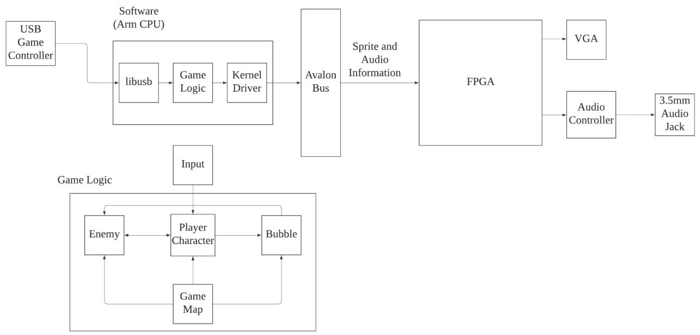
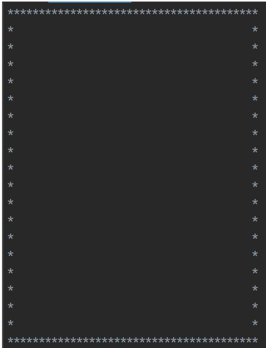
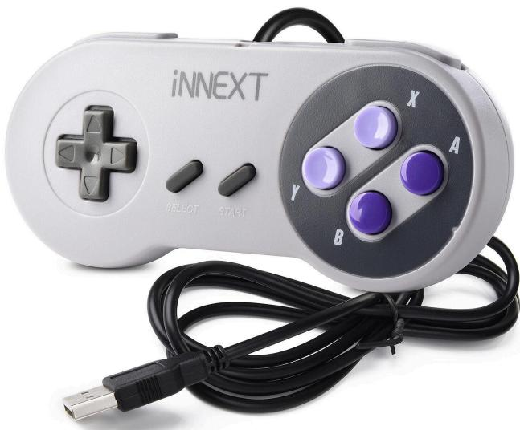
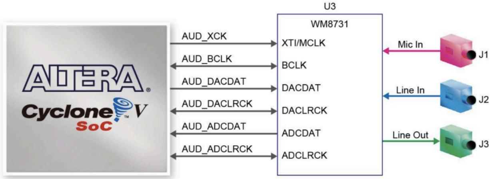
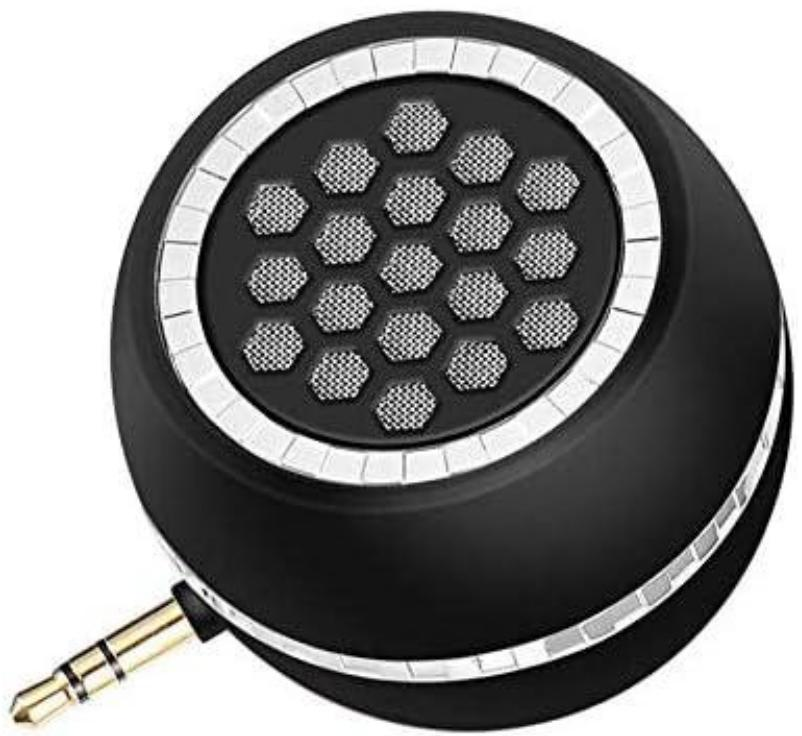

# Bubble Bobble

Hognzheng Zhu (hz2915)

Lance Chou (lz2837)

Qingyuan Liu (ql2505)

Ke Liu (kl3554)

# 1: Introduction

In this project, we plan on creating the game “Bubble-bobbles” on the DE1-SoC FPGA.

“Bubble-bobbles” is a game originally developed in the 1980s by Taito. The game features two dragons controlled by players who must defeat enemies by trapping them in bubbles shot from their mouths and popping them. All enemies on one level must be defeated in order to progress to the next level. All enemies also drop bonus items when defeated. In this case, we will implement a single-player version of the game with one controllable character (a dragon), and one enemy type as well as randomly generated levels. Players gain scores by picking up items dropped by defeated enemies. The player will interact with the game through an iNNEXT SNES gamepad controller, a 640 x 480 VGA monitor, and a speaker with a 3.5mm audio jack.

# 2: System Block Diagram



# 3: Algorithm

The player character has three lives, the player character will lose a life if he hits any enemy. The game is over once the player character loses his three lives. Enemies cannot shoot bubbles but move left, and right and jump randomly. The player character can move left, right, jump, and shoot bubbles to attack enemies under the player’s control.

If the bubble hits an enemy, the enemy will be wrapped in the bubble and will not be able to move, so if the player character touches the bubble, it will kill the enemy. After killing an enemy, a fruit will appear at that location as a bonus, and the player character can score points on the scoreboard by touching that item. The player character will reach the next level once he clears all the enemies and gets all the bonuses on this level.

The map consists only of small bricks, one by one, which should be surrounded by bricks, and both the player character and enemies can only stand on the bricks, not go through them.

Each time the player character fires bubbles and dies and moves on to the next level, there are different sound effects.

The number of enemies becomes more numerous as the level progresses.

Two-player mode could be implemented.

There should be a map generator to automatically generate the map of each level.

Design of map:

There should be a template txt file to represent the basic map, each * is a brick.



The map generator should add some line with * to generate different maps when moving to the next level.

map generator：  
```txt
1 Open the original file and read its content  
2 Create an empty string variable to store the content of the new file  
3  
4 Starting from the fifth last line of the file, iterate upwards until the fifth line:  
5 Read the content of the current line  
6 Create an empty string variable to store the new content of the current line  
7 Set a flag to false to indicate whether a star queue exists in the current line  
8 Iterate backwards from the left of the line, checking every three characters:  
9 Count the number of ' ' between the current position and the previous '*  
10 Ensure at least five ' ' between each star queue  
11 Add the 5 ' ' to the string  
12 Generate a random number between 3 and 8 to represent the length of the current star queue  
13 Add the corresponding number of '*' to the string variable to represent a star queue  
14 Set the flag to true to indicate the presence of a star queue in the current line  
15 Exit the loop  
16 Append the new content of the current line to the content of the new file  
17  
18 Write the content of the new file to a new txt file  
19 Close the file  
20 
```

# 4: Resource Budget

Graphics:

<table><tr><td>Category</td><td colspan="3">Graphics</td><td>Size(bits)</td><td># of images</td><td>Total size(bits)</td></tr><tr><td>Characters</td><td></td><td></td><td></td><td>36x36</td><td>4</td><td>36x36x4x24=124,416</td></tr><tr><td>Enemy#1</td><td></td><td></td><td></td><td>36x36</td><td>4</td><td>36x36x4x24=124,416</td></tr><tr><td>Enemy#2</td><td></td><td></td><td></td><td>36x36</td><td>4</td><td>36x36x4x24=124,416</td></tr><tr><td>Props#1</td><td></td><td></td><td></td><td>18x18</td><td>5</td><td>18x18x5x24=38,880</td></tr><tr><td>Props#2</td><td></td><td></td><td></td><td>18x6</td><td>2</td><td>18x6x2x24=5,184</td></tr><tr><td>Props#3</td><td></td><td></td><td></td><td>7x21</td><td>4</td><td>7x21x4x24=14,112</td></tr></table>

<table><tr><td>Bubble bullets</td><td colspan="2"></td><td>12x12</td><td>1</td><td>12x12x1x24
3456</td></tr><tr><td>Character Death Animation</td><td colspan="2"></td><td>36x36</td><td>2</td><td>36x36x2x24
=62,208</td></tr><tr><td>Enemy#1 Death Animation</td><td colspan="2"></td><td>36x36</td><td>2</td><td>36x36x2x24
=62,208</td></tr><tr><td>Enemy#2 Death Animation</td><td colspan="2"></td><td>36x36</td><td>2</td><td>36x36x2x24
=62,208</td></tr><tr><td>Brick</td><td colspan="2"></td><td>9x9</td><td>3</td><td>9x9x3x24
=5832</td></tr><tr><td colspan="5">Total</td><td>627,336bits</td></tr></table>

Audio:   

<table><tr><td>Category</td><td>Times(s)</td><td>Frequency(kHz)</td><td># of Bits</td></tr><tr><td>Background Music</td><td>15s</td><td>8</td><td>240,000*16
=1,920,000</td></tr><tr><td>Damage Enemy</td><td>0.3</td><td>8</td><td>2,400*16
=38,400</td></tr><tr><td>Enemy Destroyed</td><td>0.3</td><td>8</td><td>2,400*16
=38,400</td></tr><tr><td>Player Takes Damage</td><td>0.3</td><td>8</td><td>2,400*16
=38,400</td></tr><tr><td>Player Loses a Life</td><td>0.3</td><td>8</td><td>2,400*16
=38,400</td></tr><tr><td>Game Over</td><td>3</td><td>8</td><td>24000*16
=384,000</td></tr><tr><td>Victory</td><td>3</td><td>8</td><td>24000*16
=384,000</td></tr></table>

<table><tr><td>Total</td><td>2,841,600</td></tr></table>

The DE1-SoC board provides 4,450 Kbits. Our memory size is only 3468 Kbits, so our initial design should fit well within the provided resources.

# 5: The Hardware/Software Interface

# Controller:

We will be using an iNNEXT SNES gamepad controller to interact with the game. The controller is connected to the SoC via a USB port.

  
Figure 5.1: The iNNEXT SNES gamepad controller

The player can interact with the player character with these actions:

Move left: pressing the left arrow button turns the PC leftward, and holding the button moves the PC left

Move right: pressing the right arrow button turns the PC rightward, holding the button moves the PC right

Jump: holding the up arrow button causes the PC to jump to a certain height, releasing the button earlier allows the PC to stop rising and start falling.

Shoot bubbles: pressing the X button shoots a bubble horizontally from the PC. The bubble goes left if the PC faces left, and goes right if the PC faces right.

# Audio:

The Cyclone V SoC comes with a Wolfson WM8731 CODEC chip, which generates ADC and DACs to interface with analog jacks and the FPGA with a digital interface. This chip has 24-bit audio capabilities. Given we have 1 audio speaker, we will use one of the DAC channels of the CODEC to transmit the signal,

  
Figure 5.2: Wolfson chip block diagram



Figure 5.3: portable speaker with 3.5mm audio jack

# VGA Monitor:

The display consists of 3 layers. The background layer provides an empty background as a setting for the game. The foreground layer includes game objects such as maps/bricks, bubbles, PC, enemies, and items. The statistic layer is the frontmost layer and displays the player's health and score.

For feeding information to the VGA monitor, we use a 32-bit width bus, which allows at maximum, coordinates for a single object to be written. In addition, we also allocated 16 bits for registered addresses

The rest is the standard VGA controller interface, which includes:

standard controller inputs: clk, reset

Avalon bus interfaces: write, chipselect

VGA monitor interface:

VGA_B [7…0]

VGA_BLANK_n

VGA_CLK

VGA_G [7…0]

VGA_HS

VGA_R [7…0]

VGA_SYNC_n

VGA_VS

The controller contains registers for storing various data needed to be shown on the monitor at real-time. This includes:

# Score system:

The scoring system uses 4 digits to keep track of the player's score.

Each digit takes 4 bits to store, totaling 16 bits. The entire register is one 16-bit register, with accessing done by slicing.

# Player status:

A single 4-bit register is allocated for storing the player's current life counts

# Entity position:

Since we are using a VGA monitor with a resolution of $6 4 0 \times 4 8 0$ , we need 19 bits in total to store a position for each entity (player character or NPC). 10 bits for its horizontal position, 9 bits for its vertical position. For ease of use, we allocated 2 16-bit registers for each coordinate. There is memory allocated for 1 Player Character, 6 Enemies, 30 bubbles, and 6 items. Changing position, calculating hitbox, and resolving collisions will

all be done on the software side. The software will write the coordinates change through the bus to the monitor.

# Sprite enumeration:

Each entity has several sprites to show their direction and form animations. Both PC and enemies have 6 sprites each, 4 for walking in each direction, 2 for death animations. The enemies also have a form where it is in a bubble, thus a 4-bit register is assigned to the PC and each enemy, taking 28 bits.

# Address mapping:

<table><tr><td>Address</td><td colspan="2">Length</td><td>meaning</td></tr><tr><td rowspan="2">00-01</td><td colspan="2">0-15</td><td>PC position-x, column</td></tr><tr><td colspan="2">0-15</td><td>PC position-y, row</td></tr><tr><td rowspan="2">02-13</td><td colspan="2">0-15</td><td>Enemy pos-x, column</td></tr><tr><td colspan="2">0-15</td><td>Enemy pos-y, row</td></tr><tr><td rowspan="2">14-73</td><td colspan="2">0-15</td><td>Bubble pos-x, column</td></tr><tr><td colspan="2">0-15</td><td>Bubble pos-y, row</td></tr><tr><td rowspan="2">74-85</td><td colspan="2">0-15</td><td>Item pos-x, column</td></tr><tr><td colspan="2">0-15</td><td>Item pos-y, row</td></tr><tr><td>86</td><td colspan="2">0-15</td><td>Player score</td></tr><tr><td>87</td><td></td><td>0-3</td><td>Player health</td></tr><tr><td>88</td><td></td><td>0-3</td><td>PC sprite</td></tr><tr><td>89-94</td><td></td><td>0-3</td><td>Enemies sprite</td></tr></table>