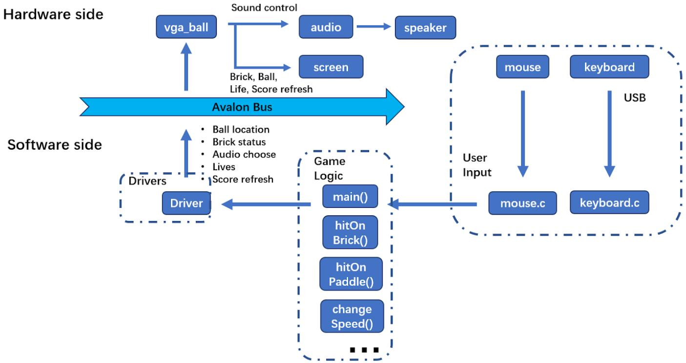
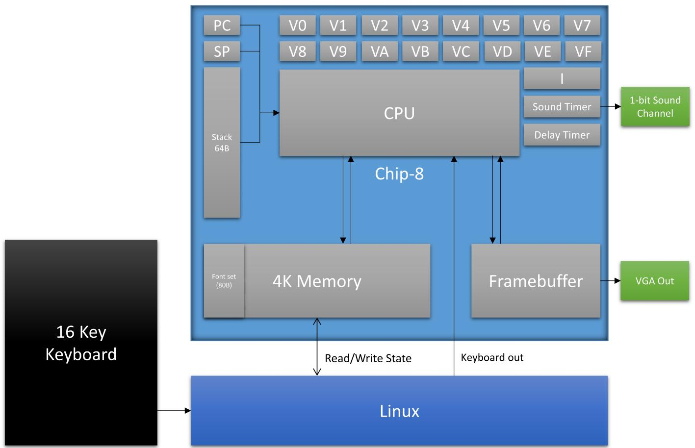
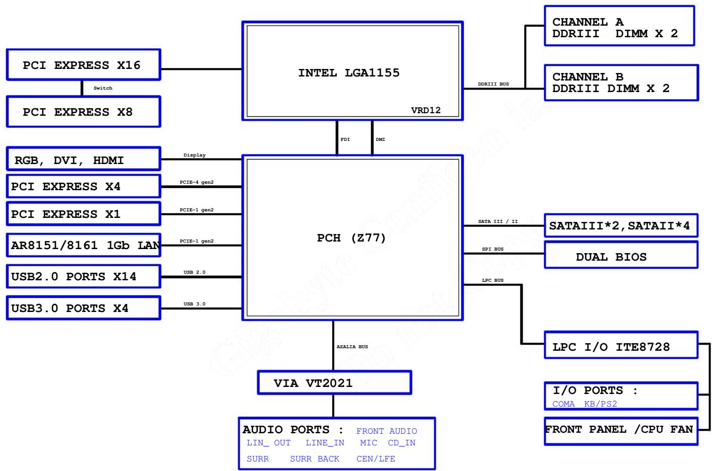
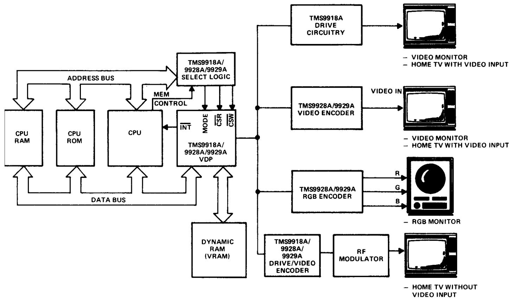
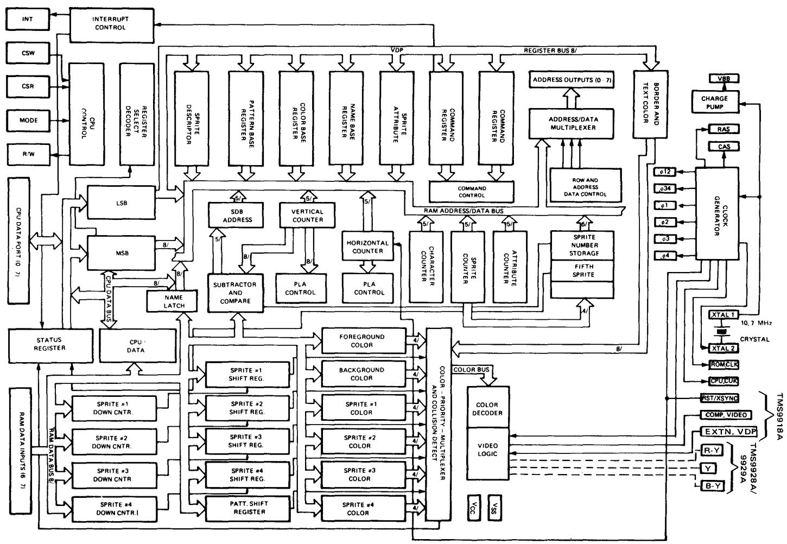
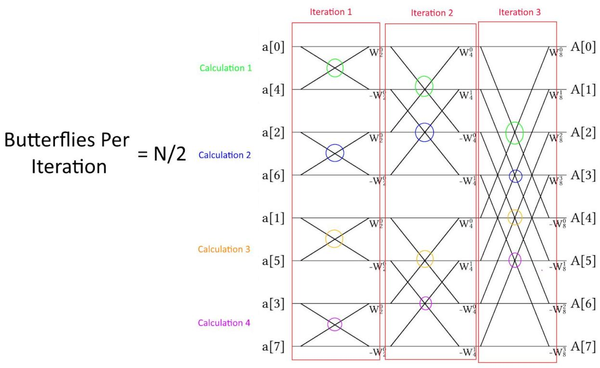
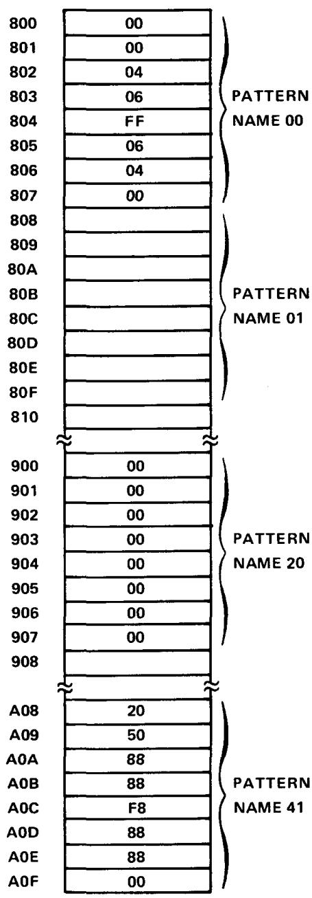

# The Design Document for CSEE 4840 Embedded System Design

Stephen A. Edwards (se2007)

Spring 2022

# Contents

1 Introduction 2   
2 System Block Diagram 2   
3 Algorithms 8   
4 Resource Budgets 11   
5 The Hardware/Software Interface 13

# 1 Introduction

The design document should clearly illustrate what it is you plan to build and how you plan to build it. It should capture all the high-level decisions, e.g., what should be in hardware, what should be in software, what hardware modules you will develop, how every piece of your system will communicate with other pieces, and how many resources your design will consume.

Think of your system as an algorithm that will be run on some mix of hardware and software. Describe both the algorithm and the hardware/software structures that will execute it.

Your system will consist of multiple pieces that communicate. Spend an equal amount of time describing the pieces and describing the communication among them.

# 2 System Block Diagram

Include a block diagram of your project that shows both hardware and software components. Make this reasonably detailed and contain, say, about ten blocks. Every project will include a DE1-SoC with software and hardware, but what software components will you have and how will they communicate? Similarly, what hardware components will you have and how will they communicate?

Block diagrams consist of functional blocks and communication pathways between them. Describe what each block does and the communication protocol used along each pathway.

  
Figure 1: Block diagram of 2019’s BrickBreaker (Chen, Xu, Wu, and Shi). This should have included more detail about how the video system actually worked; they didn’t really use the vga_ball from Lab 3. There should have been more detail to the game logic.

  
Figure 2: Block diagram from 2016’s Chip8 (Kling, Oliver, Taylor, and Watkins). They should have included more detail about each block and connection, e.g., the width of the connection to memory, how the keyboard communicated with Linux, and the size of the framebuer.

  
Figure 3: Block diagram for a commercial motherboard (Gigabyte GA-Z77MX-D3H). This could have included more details about the width of the various busses. Since this is largely a hardware design, it does not describe any software.

  
Figure 4: Block diagram of a system employing the TMS9918A Video Display Processor (commercial, from TI). This is actually illustrating numerous possible systems as they don’t intend for all four video outputs to be present simultaneously. Notice also the deliberate dierence in detail between user-supplied components such as the CPU and the prescribed components such as the TMS9918A.

  
Figure 5: Block diagram of the TMS9918A Video Display Processor Chip (commercial, from TI). This is far too detailed and its structure appears to be intended to ll the page rather than trying to convey the relationship among the blocks. The important components are the various counters and registers in the lower left and the color priority multiplexer they feed into, but the many seemingly unrelated registers on the top half are distracting.

# 3 Algorithms

Describe the algorithms your project will implement, for both hardware and software. For example, a game project using a tile-and-sprite graphics generator should describe the game logic (e.g., rules for how the player and enemies move), the algorithm used to generate the graphics (e.g., a dual-ported memory array that holds the sprite descriptor table that the sprite controller consults at the beginning of each line to draw each active sprite in a dual line buer), algorithms for generating sounds (e.g., a collection of four square-wave oscillators whose amplitude and period is under software control).

For hardware accelerator projects, this section is especially important. You need to know your algorithm thoroughly before you attempt to implement it in hardware. The best approach is to rst write a protoype of your algorithm in your favorite language. C is well-suited to this because things that are complicated in C (such as memory management) is also dicult in hardware.

# 3.1 Arbitrage Identification

Triangular arbitrage opportunities arise when a cycle is determined such that the edge weights satisfy the following expression:

$$
w _ {1} ^ {*} w _ {2} ^ {*} w _ {3} ^ {*} \dots^ {*} w _ {n} > 1
$$

However, cycles that adhere to the above requirement are particulary difficult to find in graphs. Instead we must transform the edge weights of the graph so that standard graph algorithms can be used. First we take the logarithm of both sides, such that:

$$
\log \left(w _ {1}\right) + \log \left(w _ {2}\right) + \log \left(w _ {3}\right) + \dots + \log \left(w _ {n}\right) > 0
$$

If instead we take the negative log, this results in a sign flip:

$$
\log \left(w _ {1}\right) + \log \left(w _ {2}\right) + \log \left(w _ {3}\right) + \dots + \log \left(w _ {n}\right) <   0
$$

Thus, if we look for negative weight cycles using the logarithm of the edge weights, we will find cycles that satisfy the requirements outlined above. Luckily, the Bellman-Ford algorithm is a standard graph algorithm that can be used to easily detect negative weight cycles in O(VE) time.

# 3.2 Bellman-Ford Algorithm

# Algorithm 3.1: Standard Bellman-Ford

Let G(V, E) be a graph with vertices, V, and edges, E.   
Let w(x) denote the weight of vertex x.   
Let w(i, j) denote the weight of the edge from source vertex i to destination vertex j.   
Let p(j) denote the predecessor of vertex j.

```txt
for each vertex x in V do  
if x is source then  
w(x) = 0  
else  
w(x) = INFINITY  
p(x) = NULL  
end if  
end for  
for i = 1 to v - 1 do  
for each edge(i, j) in E do  
if w(i) + w(i, j) < w(j) then //Relaxation  
w(j) = w(i) + w(i, j)  
p(j) = i  
end if  
end for  
end for  
for each edge(i, j) in E do  
if w(j) > w(i) + w(i, j) then  
//Found Negative-Weight Cycle  
end if  
end for 
```

The Bellman-Ford algorthm is a standard graph algorithm that seeks to solve the single-source shortest path problem. Mainly this problem describes the situation in which a source node is selected and the shortest paths to every other node in the graph need to be determined. In unit graphs, breath first search may be used, but in graphs that have nonunit edge weights the Bellman-Ford algorthm must be used.

Briefly, in the Bellman-Ford algorithm "each vertex maintains the weight of the shortest path from the source vertex to itself and the vertex which precedes it in the shortest path. In each iteration, all edges are relaxed $[ \mathsf { w } ( \mathrm { i } ) + \mathsf { w } ( \mathrm { i } , \mathrm { j } ) < \mathsf { w } ( \mathrm { j } ) ]$ and the weight of each vertex is updated if necessary. After the ith iteration, the algorithm finds all shorest paths consisting of at most i edges." After all shortest paths have been identified, the algorithm loops through all of the edges and looks for edges that can further decrease the value of the shortest path. If this case then a negative weight cycle has been found since a path can have at most v-1 edges. Proof of correctness can be found in Introduction to Algorithms by Cormen, Leiserson, Rivest, and Stein.

Figure 6: Algorithm description from the Forex project (2016: Gobieski, Kwan, Zhu, and Liu). They looked for arbitrage opportunities by quickly performing Bellman-Ford on the logarithms of exchange rates. Their pseudocode could have been more consise, but at least the structure is clear.

The base hardware block used to find the FFT is the ButterflyModule, which performs a single radix-2 FFT calculation. This module takes in two complex inputs, in addition to a static complex coefficient, and produces two complex outputs. We use a single butterfly module in the computation stage, iterating through the input buffer and writing the results of the butterfly calculation to the same buffer location as the inputs. This allows us to cut the memory overhead of the calculation stage in half . This is done down the entire buffer, and is repeated for2 log2(NFFT) iterations (9 times for out 512 point output). Our sequential approach to calculating FFTs is very similar to the method described by Cohen, and is explained more in-depth in his 1977 paper . 3

  
Iterations = log2(N)   
Figure 7: Algorithm description from Totally Not Shazam (2019: Kaplan, Rubianes, and Pera-Chamblee). Part of their song recognition algorithm involved performing a fast Fourier transform, illustrated here.

# 4 Resource Budgets

Resource budgets, e.g., for on-chip memory, multipliers on the FPGA, network bandwidth, or anything else in limited supply that you plan to consume a lot of.

Graphic images and sampled audio both tend to consume a lot more memory than you’d expect. The memory on the FPGA of the DE1-SoC is less than half a megabyte. There is much more o-chip, but it becomes increasingly dicult to access.

For accelerators, the main consideration is how much input and how much output need to reside in the FPGA at one time, and whether the FPGA can accommodate it all. It’s always possible to move data into and out of the FPGA as it is being processed, or even give the FPGA direct access to HPS memory, but these are much more dicult

<table><tr><td>Category</td><td colspan="2">Graphics</td><td>Size (bits)</td><td># of images</td><td>Total size (bits)</td></tr><tr><td>Bricks</td><td></td><td></td><td>64*32</td><td>2</td><td>98,304</td></tr><tr><td>Ball</td><td colspan="2"></td><td>16*16</td><td>1</td><td>6,144</td></tr><tr><td>Padel</td><td colspan="2"></td><td>90*20</td><td>1</td><td>43,200</td></tr><tr><td>Lives</td><td colspan="2"></td><td>24*22</td><td>1</td><td>12,672</td></tr><tr><td>Number</td><td colspan="2">1 2 3</td><td>20*20</td><td>10</td><td>96,000</td></tr><tr><td>Score</td><td colspan="2">S C O R E</td><td>100*20</td><td>1</td><td>48,000</td></tr><tr><td>Game Status</td><td></td><td></td><td>45*45</td><td>2</td><td>48,600</td></tr><tr><td></td><td colspan="4">Memory Budget (bits)</td><td>352920</td></tr></table>

Figure 8: Graphics and audio memory budgets from 2019’s BrickBreaker (Chen, Xu, Wu, and Shi).   

<table><tr><td colspan="4">Audio memory budget</td></tr><tr><td></td><td>background music</td><td>hit brick</td><td>hit wall</td></tr><tr><td>time(s)</td><td>15.2</td><td>0.35</td><td>0.23</td></tr><tr><td>fs(kHz)</td><td>8</td><td>8</td><td>8</td></tr><tr><td>memory(bit)</td><td>121593 * 16</td><td>2869 * 16</td><td>1815 * 16</td></tr><tr><td colspan="3">total</td><td>2,020,432 bits</td></tr></table>

# 5 The Hardware/Software Interface

Include a detailed plan for the hardware/software interface, i.e., the number, size, and meaning of each bit in each status or control register. Most chip documentation boils down to this sort of information: detailed instruction of how to write the software to take advantage of the hardware.

# Register 1 (Contains Eight VDP Control Bits)

REGISTER 1

<table><tr><td colspan="6">LSB
D0</td><td colspan="3">MSB
D7</td></tr><tr><td>4/16
K</td><td>BLK.
SCRN</td><td>IE</td><td>M1</td><td>M2</td><td>0</td><td>SPR.
SIZE</td><td>SPR.
MAG.</td><td></td></tr></table>

Bit $0 = 4 / 1 6 \mathsf { K }$ Selection

O-Selects 4K bytes of VRAM

1-Selects 16K bytes of VRAM.

# NOTE

This bit is used only on the TMS9918A/28A/29A.When using TMS9118/28/

29 this bit is a "Don't Care"and can be set to either state.The TMS9118/28/

29 Family assumes 16K of VRAM is present.

Bit $\uparrow =$ Display Blank Enable/Disable

O-Causes the active display area to blank

1-Enables the active display

Blanking causes the Sprite and Pattern Planes to blank but stillalows the Backdrop color to show through. Blanking the display does not destroy any tables in VRAM.

Bit $2 = 1 E$ (Interrupt Enable)

O-Disables VDP interrupt

1-Enables VDP interrupt

If the VDP interrupt is connected in hardware and enabled by this bit,it willoccur at the end of the active screen display area,just before vertical retrace starts.Exceptionally smooth,clean pattern drawing and sprite movement can be achieved by writing to the VDP during the period this interrupt is active.

Bit $3 , 4 = 1 1 1$ ,M2 (Pattern Mode Bits 1 and 2)

Refer to Bit 6 of Register O for a description of these bits.

Bit ${ \mathfrak { s } } =$ Reserved Bit (must be set to O)

Bit ${ \mathfrak { e } } =$ Sprite Size Select

O-Selects Size 0 sprites (8x8 pixels)

1-Selects Size 1 sprites (16x16 pixels)

Bit $7 =$ Sprite Magnify Option

0-Selects no magnification

1-Selects a magnification of 1,thus 8x8 sprites become 16x16 and 16x16 sprites become $3 2 \times 3 2$ .

Figure 9: A single register in the TMS9918A Video Display Processor (commercial, from TI). Ultimately, this is the level of detail you need when describing control registers.

  
Figure 10: The Pattern Table in the TMS9918A Video Display Processor (commercial, from TI). Here, each byte represents eight two-color pixels, and each byte is interpreted the same way, so a table makes more sense.