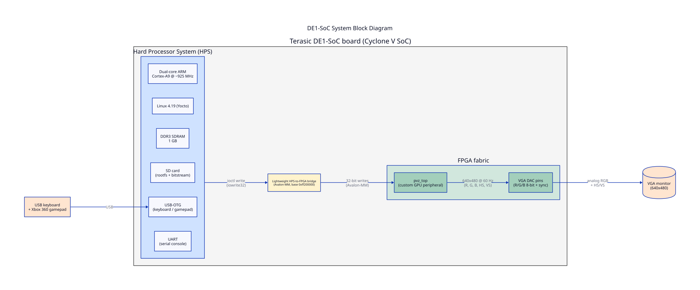
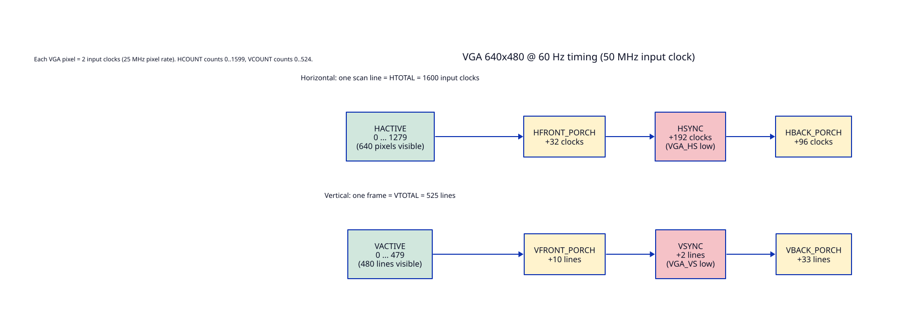

# 02 — Embedded-systems background

This chapter is for the reader who is comfortable in C and Linux but
has never touched an FPGA, a devicetree, or a memory-mapped peripheral
before. If you have done CSEE4840 lab 3, you can skim this and go to
chapter 03.

## The board: Terasic DE1-SoC



The DE1-SoC is built around an Altera (Intel) **Cyclone V SoC**. The
chip has two halves:

- **HPS — Hard Processor System.** A dual-core ARM Cortex-A9 running
  at about 925 MHz, with its own DDR3 SDRAM controller, USB OTG,
  Ethernet, SD card controller, UART, and a handful of other peripherals.
  This half runs Linux 4.19 from an SD card the same way a Raspberry Pi
  does.

- **FPGA fabric.** Programmable logic — a sea of look-up tables (LUTs),
  flip-flops, and small embedded memory blocks ("M10K" blocks, 10 kbit
  each). You describe what hardware you want in SystemVerilog, the
  Quartus toolchain *synthesizes* and *fits* it onto the silicon, and
  the result is a **bitstream** (`.rbf` file) the board loads at boot.

The two halves live on the same die. They communicate through several
**bridges** — buses that cross the HPS/FPGA boundary. We use exactly
one: the **lightweight HPS-to-FPGA bridge**, mapped at physical address
`0xff200000` in the ARM's address space. From the FPGA side, this bus
speaks the **Avalon-MM** protocol (see below).

## FPGA vs. processor — the mental model shift

A CPU executes one instruction at a time on a fixed pipeline. The
clock ticks; the program counter advances; instructions in flight
move forward one stage.

An FPGA is the opposite. Every line of SystemVerilog turns into a
piece of dedicated circuitry that runs in parallel on every clock
edge. There is no program counter and no instruction stream. If you
write

```systemverilog
always_ff @(posedge clk) counter <= counter + 1;
```

then on every rising edge of `clk`, a 32-bit adder reads `counter`,
adds 1, and writes the result back into a 32-bit register. That
adder exists physically and does its thing 50 million times per
second. If you write *two* such blocks, both adders exist and both
run in parallel.

This matters for VGA. A monitor demands a new pixel every 40 ns
(25 MHz pixel clock). A CPU would have to interrupt its work
constantly to feed pixels out a port; the FPGA just *generates them*
as a side effect of counting clocks. That is why we run the renderer
in the fabric, not on the ARM.

## VGA basics

`hw/vga_counters.sv` produces standard 640 × 480 @ 60 Hz analog VGA
from the board's 50 MHz input clock.



Every video line has four regions: active video (the visible pixels),
front porch (blank), sync pulse (the HS signal goes low to mark the
start of the next line), and back porch (more blank). All four added
together is **HTOTAL = 1600 input clocks per line** — but the visible
area is only 1280 clocks because we emit one VGA pixel every two
input clocks (a 25 MHz pixel rate from a 50 MHz source). Frame
structure is the same idea vertically: 480 visible lines plus 45
lines of porches and VSYNC, for VTOTAL = 525.

The `VGA_BLANK_n` signal goes low during any porch or sync region;
the top-level mux in `hw/pvz_top.sv:243-253` drives the R/G/B pins
to black during that time so the monitor sees a clean picture.

Three pieces of vocabulary you will keep meeting:

- **Pixel clock** — the rate at which VGA pixels stream out. 25 MHz
  for 640 × 480 @ 60 Hz. Derived from the 50 MHz system clock by
  taking the LSB of `hcount` (`vga_counters.sv:66`).
- **Blanking interval** — the porch + sync regions where no pixels
  are visible. Old games used this gap to update memory; we don't
  need to (see "racing the beam" below).
- **Racing the beam** — the strategy of computing pixel color in
  real time as the electron beam scans the screen, instead of storing
  a frame buffer. `entity_drawer.sv` does exactly this: for every
  (x, y) coordinate generated by `vga_counters.sv`, it figures out
  which sprite (if any) covers that pixel and outputs the color.

## The HPS side: Linux + kernel module + userspace

The HPS boots a standard Linux 4.19 kernel from the SD card. When
the kernel comes up, it walks a **devicetree** — a static tree of
nodes (`/proc/device-tree/...`) that describes every hardware
peripheral the kernel should care about. The devicetree blob
(`soc_system.dtb`) is generated from the Platform Designer system
file `hw/soc_system.qsys` by `sopc2dts` + `dtc`.

Each devicetree node has a **compatible string** like
`csee4840,pvz_gpu-1.0`. This string is the bridge between hardware
and the kernel:

- The hardware side sets it in `hw/pvz_top_hw.tcl:23`.
- The kernel side declares it in `sw/pvz_driver.c:111-115` inside the
  `of_device_id` table.

When Linux finds a devicetree node whose `compatible` string matches
a registered driver's table, it calls that driver's `probe` function.
For us, that is `pvz_probe` in `sw/pvz_driver.c:61`. The probe maps
the FPGA peripheral's physical address into the kernel's virtual
address space using `of_iomap()` (`pvz_driver.c:83`) and exposes a
character device at `/dev/pvz` (a "misc device" — the simplest kind
of character device in Linux).

Userspace can now open `/dev/pvz` and issue ioctls to it. Our single
ioctl is `PVZ_WRITE_REG` (`sw/pvz.h:74`), which writes one 32-bit
value to one register in the FPGA. The handler turns that into an
`iowrite32` to the mapped physical address — a real memory store
that the bridge converts into an Avalon-MM write transaction.

## Avalon-MM, briefly

**Avalon-MM** is Intel's on-chip bus protocol. For our purposes it
looks like a simple memory-mapped slave:

- `address` — which register the master wants to talk to.
- `writedata` — 32 bits.
- `write` — high for one cycle when the master is writing.
- `chipselect` — high when this slave is the target.

`hw/pvz_top.sv:30-45` declares those four signals and decodes them in
`pvz_top.sv:95-148`. One subtlety, called out in `pvz_top.sv:22-24`
and `pvz_top_hw.tcl:52`: this slave is configured with
`addressUnits = WORDS`, which means the `address` port counts 32-bit
words, not bytes. The CPU on the other side still thinks in bytes,
so the kernel driver multiplies the word index by 4 before writing
(`sw/pvz_driver.c:40`). This is the single most common confusion in
the codebase; remember it now.

## Toolchain names you will see

You don't need to install any of these yourself unless you are doing
a hardware build; they live on the Columbia EE workstations
(`micro*.ee.columbia.edu`). But you will see them in `hw/Makefile`:

- **Quartus Prime** — Intel's FPGA synthesizer. `quartus_sh`,
  `quartus_map`, `quartus_sta`, `quartus_cpf` are command-line entry
  points. `make quartus` in `hw/` runs the full compile.
- **Platform Designer** (formerly Qsys). Graphical (and TCL) tool
  that wires together pre-made IP blocks like the HPS, our
  `pvz_top`, and the Avalon-MM fabric. State is stored in
  `hw/soc_system.qsys` (XML). The CLI tool is `qsys-generate`.
- **sopc2dts** — converts the `.sopcinfo` file Platform Designer
  emits into a `.dts` (devicetree source).
- **dtc** — the standard devicetree compiler; turns `.dts` into
  `.dtb`.
- **arm-linux-gnueabihf-gcc** — cross-compiler. On a workstation,
  this builds binaries for the board's ARM CPU. On the board itself,
  ordinary `gcc` works.

The flow is summarized in chapter 08 and in this diagram:


