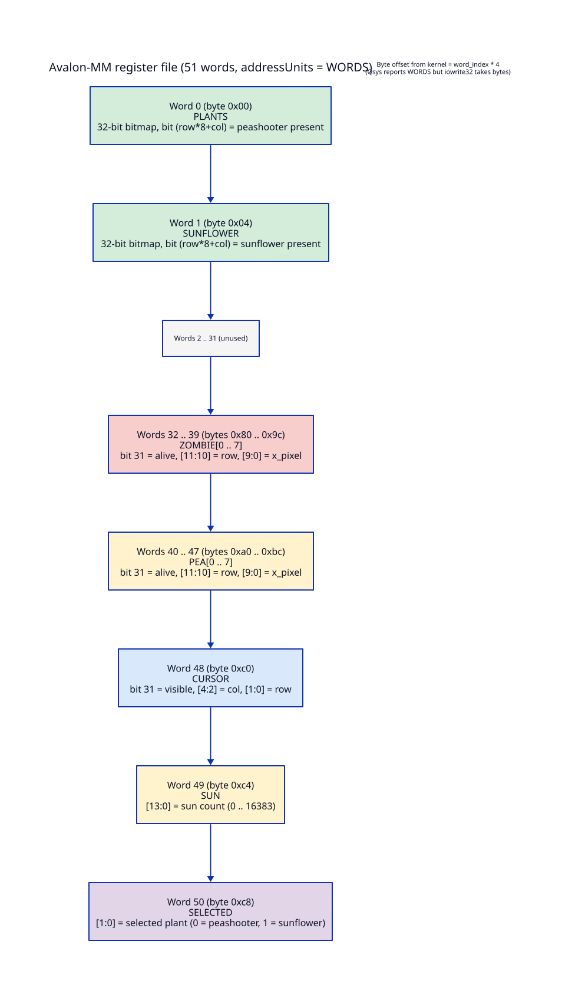
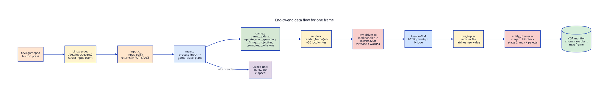
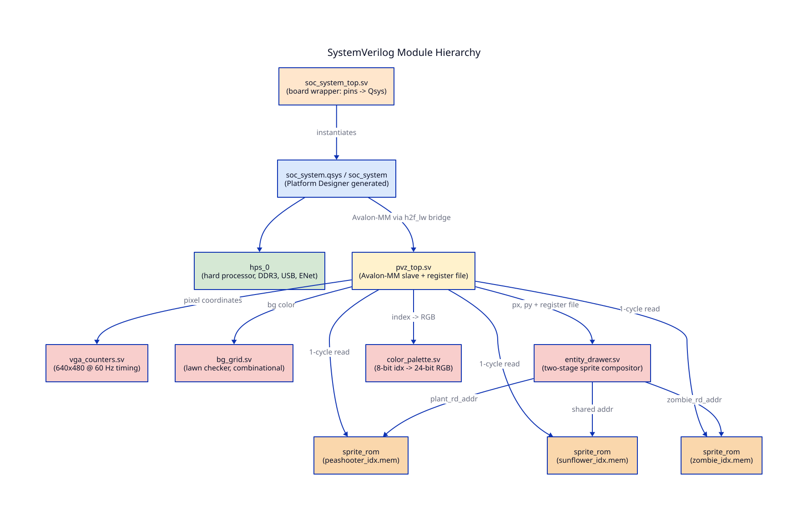

# 03 — System architecture

## Who owns what

The work is split cleanly between the two halves of the SoC.

| Half | Owns | Doesn't touch |
| ---- | ---- | ------------- |
| **HPS (Linux + C)** | All gameplay state: grid, zombies, peas, sun economy, win/lose. Reads input. Decides what should be on screen. | Has no idea what a pixel is. Doesn't generate any video signal. |
| **FPGA (SystemVerilog)** | All pixels. Reads the current "scene description" from its register file and rasterizes it to VGA every frame. | Has no game logic, no collision detection, no concept of time beyond "what cycle is it". |

The HPS describes the scene; the FPGA draws it. The HPS does not
draw anything to a frame buffer; the FPGA does not run any game
logic. The interface between them — what we will call the
**scene description** — is a 51-word register file that lives in
`pvz_top.sv` and is documented exhaustively in chapter 06.

## The communication channel: one register file

There is no shared memory between HPS and FPGA in this design. No
DMA, no interrupts, no vsync handshake. There is exactly one
communication path: the HPS writes 32-bit values into the FPGA's
Avalon-MM register file, and the FPGA reads those values
combinationally as the VGA beam scans.

The register file has 51 entries:

Two words describe all 32 plant slots as bitmaps (peashooters in
word 0, sunflowers in word 1). Eight words each describe up to 8
zombies and 8 peas. Three words describe HUD state (cursor, sun
count, selected plant type). The "unused" words 2–31 are reserved
gap space — not addressable to any hardware state.

Reading chapter 06 alongside `sw/pvz.h:42-49` and
`hw/pvz_top.sv:9-20` will give you the entire interface contract.

## End-to-end data flow for one frame

Each frame, 60 times per second, `sw/main.c:110-150` runs this
sequence:

1. **Poll input.** `input_poll()` reads any pending events from
   `/dev/input/event0` and returns an `INPUT_*` code (or `INPUT_NONE`).
2. **Update the cursor / state.** `process_input` in `main.c:34-68`
   moves the cursor, places or removes plants, toggles the selected
   plant type, or asks to quit.
3. **Run the simulation.** `game_update` in `game.c:288` steps every
   subsystem one frame: sun timer, zombie spawner, peashooter
   cooldowns, pea movement, zombie movement and eating, pea–zombie
   collisions, win check.
4. **Render to FPGA.** `render_frame` in `render.c:108` walks the
   `game_state_t` struct and issues roughly 50 ioctl writes — one
   per register that might have changed (it actually writes them
   all, every frame, unconditionally).
5. **Sleep.** Whatever time is left in this frame's 16.667 ms budget,
   `usleep` burns. Then the loop repeats.

Meanwhile, in parallel, the FPGA is doing its own loop at a
completely different rate. Every 40 ns (the VGA pixel clock),
`vga_counters.sv` increments `hcount`. For each (x, y), the
combinational logic in `entity_drawer.sv` computes which sprite
covers that pixel, fetches the sprite color from a sprite ROM,
maps it through the palette, and drives the analog R/G/B pins.

The HPS and the FPGA never synchronize. The HPS writes to registers
whenever it wants; the FPGA reads them whenever it scans the
relevant pixel. **This means a register write that races the beam
can produce one frame of visual tearing** — for example, a zombie
might appear half-moved on the line being scanned right when the
update lands. At 60 Hz with slow-moving sprites this is invisible,
and the design explicitly accepts it
(`hw/pvz_top.sv:25-27`). If we ever need cleaner visuals we would
add a vsync-latched shadow register, the pattern used in the lab 3
`vga_ball.sv`.

## Module hierarchy at a glance

The board pin assignments live in `hw/soc_system_top.sv`. That
top-level instantiates the Platform Designer-generated `soc_system`,
which contains two things we care about: the HPS soft block (which
boots Linux and exposes the Avalon-MM bridge), and our `pvz_top`
peripheral. `pvz_top` is the only piece of custom RTL on the FPGA
fabric. It instantiates everything else: the VGA timing generator,
the background, the three sprite ROMs, the compositor, and the
palette LUT. See chapter 04 for a tour of each file.

## Software module hierarchy at a glance

`sw/main.c` is the orchestrator. It includes `pvz.h` (the shared
register-map header), `game.h`, `render.h`, and `input.h`. Each of
those .h files has exactly one .c implementation. The kernel side
has its own pair (`pvz_driver.c` + `pvz_driver.h`) but reuses the
same `pvz.h` so the ioctl struct is identical in both halves of the
build. See chapter 05 for a tour of each file.
