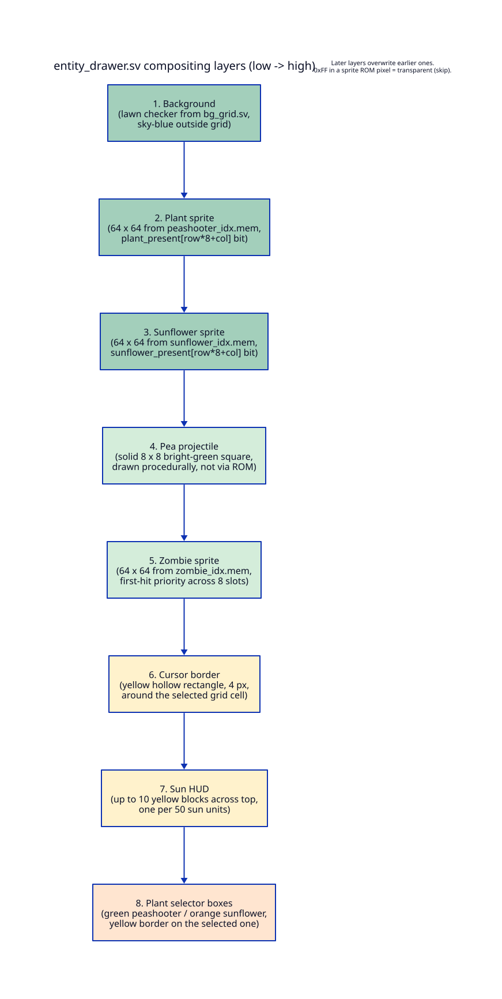

# 04 — Hardware deep dive

This chapter walks every file under `hw/`, in dependency order, and
explains what each one does and why it is structured the way it is.


## `hw/vga_counters.sv` — VGA timing generator

A direct adaptation of the lab 3 VGA timing block (credited in the
file header, `vga_counters.sv:4`). It takes the board's 50 MHz
input clock and produces:

- `hcount[10:0]`, `vcount[9:0]` — the current beam position, in
  half-pixels horizontally and full lines vertically.
- `VGA_HS`, `VGA_VS` — horizontal and vertical sync, active low.
- `VGA_BLANK_n` — high while the beam is in the visible area.
- `VGA_CLK` — the 25 MHz pixel clock, derived as `hcount[0]`
  (`vga_counters.sv:66`).

Timing parameters are at `vga_counters.sv:23-33`:

```
HACTIVE      = 1280   (half-pixels — 640 visible pixels × 2)
HFRONT_PORCH = 32
HSYNC        = 192    (VGA_HS pulse width)
HBACK_PORCH  = 96
HTOTAL       = 1600   (sum of the above)

VACTIVE      = 480
VFRONT_PORCH = 10
VSYNC        = 2      (VGA_VS pulse width)
VBACK_PORCH  = 33
VTOTAL       = 525
```

The `hcount` and `vcount` registers wrap at `HTOTAL-1` and `VTOTAL-1`
respectively (`vga_counters.sv:41-50`). The sync pulses fire in a
specific count range, encoded with bit-slicing for a small comparator
(`vga_counters.sv:52-57`). `pvz_top.sv` consumes `hcount[10:1]` as
the pixel x (one tick per pixel) and `vcount` directly as the pixel y
(`pvz_top.sv:65-66`).

## `hw/bg_grid.sv` — lawn checkerboard

Combinational. Given a pixel (px, py), returns the 8-bit palette index
for the background at that pixel. No state, no clock, no register
file.

The visible game area is hardcoded as `GRID_X=64, GRID_Y=112,
GRID_W=512, GRID_H=256` (`bg_grid.sv:28-31`) — that is, an 8 × 4
block of 64-pixel cells starting 64 pixels from the left edge and
112 pixels from the top. Outside that rectangle, the background is
"sky blue" (palette index 13, `bg_grid.sv:25`); inside, it alternates
between dark green and light green by `(col + row) parity`
(`bg_grid.sv:44-54`).

The parity expression deserves a closer look:

```
wire light_cell = gx[6] ^ gy[6];   // bg_grid.sv:45
```

Because `CELL_SIZE` is 64 = 2^6, bit 6 of the in-grid offset is the
LSB of the column index (`gx[8:6]` is the full column index 0–7) and
similarly bit 6 of `gy` is the LSB of the row index. XORing them gives
the parity directly without any multiply or divide. This kind of
bit-slicing for power-of-two arithmetic shows up all over the design.

`entity_drawer.sv` re-derives the same `GRID_X`, `GRID_Y`, and `CELL`
constants (`entity_drawer.sv:92-94`), and the software does too
(`sw/pvz.h:30-33`). Keeping these three in sync by hand is a
maintenance hazard but unavoidable given the build flow.

## `hw/sprite_rom.sv` — 64 × 64 palette-indexed sprite

The whole module is 28 lines (`sprite_rom.sv:11-28`). It is a
parameterized 4096 × 8-bit synchronous ROM:

```systemverilog
module sprite_rom #(parameter MEM_FILE = "peashooter_idx.mem") (
    input  logic        clk,
    input  logic [11:0] addr,
    output logic [7:0]  pixel
);
    logic [7:0] rom [0:4095];
    initial begin $readmemh(MEM_FILE, rom); end
    always_ff @(posedge clk) pixel <= rom[addr];
endmodule
```

A few things are happening here that matter:

1. **`$readmemh` reads the .mem file at synthesis time** and bakes
   the values into the bitstream. There is no runtime loading. To
   change a sprite, you re-synthesize.
2. **`always_ff` makes this a synchronous read.** Quartus infers this
   as an M10K block RAM with a registered output. That gives you
   exactly **one cycle of read latency**: address `A` goes in on cycle
   N, `pixel` is valid on cycle N+1.
3. The whole pipeline in `entity_drawer.sv` is built around that
   one cycle of latency — addresses are issued combinationally in
   "stage 1" and the registered hit/miss decision is matched up with
   the ROM output in "stage 2" (more on this below).



`pvz_top.sv:179-199` instantiates three of these ROMs with three
different `MEM_FILE` parameters: `peashooter_idx.mem`,
`sunflower_idx.mem`, `zombie_idx.mem`.

## The sprite art: `.mem` files

`peashooter_idx.mem`, `sunflower_idx.mem`, `zombie_idx.mem` each hold
4096 bytes of hex (one per line), one per pixel of a 64 × 64 sprite.
Each byte is either a palette index in `0x00 .. 0x0C` or `0xFF` for
"transparent — skip this pixel" (`sprite_rom.sv:5-8`).

`peas_idx.mem` is also committed (1024 lines, suggesting a 32 × 32
sprite) but the current engine **does not use it**. Peas are drawn
procedurally in `entity_drawer.sv:336-337` as a solid 8 × 8 square
in palette index 9 (bright green), with no ROM lookup. The .mem
file is leftover from an earlier sprite-pea attempt.

## `hw/color_palette.sv` — 8-bit index → 24-bit RGB

A simple combinational 256-entry case statement
(`color_palette.sv:31-49`). Only indices 0–13 have meaningful colors;
everything else is black:

| idx | color | hex | used for |
|-----|-------|-----|----------|
| 0  | black        | 00 00 00 | unused / default |
| 1  | dark green   | 1B 5E 20 | lawn (dark cells) |
| 2  | light green  | 2D 8B 2D | lawn (light cells) |
| 3  | brown        | 8B 45 13 | soil / plant stem |
| 4  | yellow       | FF D7 00 | cursor border, sun HUD, selector border |
| 5  | red          | FF 00 00 | zombie body |
| 6  | dark red     | 8B 00 00 | zombie head |
| 7  | green        | 00 80 00 | peashooter, selector-0 fill |
| 8  | dark green 2 | 00 64 00 | peashooter stem |
| 9  | bright green | 00 FF 00 | pea projectile |
| 10 | white        | FF FF FF | reserved for HUD digits |
| 11 | gray         | 80 80 80 | reserved for HUD background |
| 12 | orange       | FF A5 00 | selector-1 fill (sunflower) |
| 13 | sky blue     | 87 CE EB | background outside grid |

Indices 10 and 11 are wired in the palette but not yet used by
`entity_drawer.sv` (no digit rendering on this branch). When you add
HUD digits later, you will pick them up from here.

## `hw/entity_drawer.sv` — the compositor

This is the heart of the design. 360 lines, no FSM, no frame buffer.
For every VGA pixel, it computes the final 8-bit color index by
checking which entity covers that pixel and which sprite ROM byte
applies, then layering them in Z-order.

### Stage 1: combinational hit detection (`entity_drawer.sv:140-280`)

Stage 1 is pure combinational logic. Given the current `(px, py)` from
`vga_counters`, it computes a bunch of boolean "this entity covers
this pixel" signals.

**Grid math** (`entity_drawer.sv:140-166`). First, is `(px, py)`
inside the lawn? If yes, what cell, and what is the pixel offset
within that cell? Because cells are 64 px = 2^6, all of this is bit
slicing:

```
gx = px - 64;   gy = py - 112;          // entity_drawer.sv:149-150
cell_col  = gx[8:6];                    // 0..7
cell_row  = gy[7:6];                    // 0..3
in_cell_x = gx[5:0];                    // 0..63
in_cell_y = gy[5:0];                    // 0..63
plant_idx = {cell_row, cell_col};       // 5-bit cell index (0..31)
plant_here     = in_grid && plant_present[plant_idx];
sunflower_here = in_grid && sunflower_present[plant_idx];
plant_rd_addr  = {in_cell_y, in_cell_x};  // 12 bits → both plant ROMs
```

The peashooter and sunflower ROMs both receive the same address
(`pvz_top.sv:179-191`) because they will be queried for the same cell
pixel — and only one of `plant_here` or `sunflower_here` will be true
for any given cell, so only one's output ends up surviving the mux in
stage 2.

**Zombie hit detection** (`entity_drawer.sv:173-194`). A priority
encoder over the 8 zombie slots. For each alive zombie, it checks
whether `(px, py)` falls inside that zombie's 64 × 64 bounding box
at `(zombie_x[i], GRID_Y + zombie_row[i] * 64)`. First hit wins —
zombies don't overlap in normal play, so the priority order doesn't
matter much. The 6-bit pixel offset inside the matched zombie
becomes the sprite ROM address (`entity_drawer.sv:194`).

**Pea hit detection** (`entity_drawer.sv:199-211`). Same idea but
peas are 8 × 8, vertically centered in their row (`+28` offset on
y, `entity_drawer.sv:205`). All 8 slots are OR-reduced — peas are
solid color so we don't care which one we hit.

**Cursor border** (`entity_drawer.sv:213-230`). A hollow yellow
rectangle: the pixel must be inside the cursor cell *and* within
`CURSOR_BORDER = 4` pixels of one of its four edges
(`entity_drawer.sv:224-228`).

**Plant-selector boxes** (`entity_drawer.sv:240-264`). Two
always-visible 48 × 48 fills near the top-left of the screen, plus a
yellow border that the stage-2 mux only paints around the *currently
selected* one. This is how the TAB / shoulder-button toggle in
`sw/main.c:58-62` becomes a visible cursor shifting between the two
plant icons.

**Sun HUD** (`entity_drawer.sv:268-280`). Up to 10 yellow blocks
across the top of the screen, one per `SUN_PER_BLOCK = 50`
(`entity_drawer.sv:108`) units of sun. Block `i` is lit when
`sun_value >= (i+1) * 50`. The comment on line 267 says "100 sun"
but the localparam and the formula on line 275 use 50; trust the
code.

### Stage 2: registered mux (`entity_drawer.sv:282-358`)

Everything from stage 1 is registered into `_d` ("delayed") versions
at the next clock edge (`entity_drawer.sv:297-325`). This serves
exactly one purpose: by the time stage 2 runs, the sprite ROMs have
finished their 1-cycle read and `plant_rd_pixel` / `sunflower_rd_pixel`
/ `zombie_rd_pixel` carry the correct sprite color for the pixel that
*used to be* under the beam one cycle ago. The registered hit signals
match up with those registered ROM outputs.

The final mux paints layers bottom-up (`entity_drawer.sv:330-358`):



The 0xFF transparency convention is enforced at every sprite layer:

```systemverilog
if (plant_here_d && plant_rd_pixel != COL_TRANSPARENT)
    color_out = plant_rd_pixel;          // entity_drawer.sv:332-333
```

If the sprite byte is 0xFF, the layer underneath shows through.

### Why two stages

If the sprite ROM had zero read latency, this could all be one big
combinational expression. M10K block RAMs in Cyclone V have
**registered outputs** (`sprite_rom.sv:25-26`), so we must let the
read settle for a full cycle before using its result. The two-stage
pipeline absorbs that latency cleanly. The cost is one cycle of
end-to-end delay between `(px, py)` and `color_out`, which is
invisible at 25 MHz pixel rates.

## `hw/pvz_top.sv` — Avalon-MM peripheral + plumbing

This is the file that Platform Designer instantiates as a component
("pvz_top_0"). 255 lines.

**Ports** (`pvz_top.sv:30-45`). One Avalon-MM slave (`address`,
`writedata`, `write`, `chipselect`), one VGA conduit (R/G/B + the
four sync signals), the clock, the reset. No interrupts, no readback
path.

**Avalon write decoder** (`pvz_top.sv:95-148`). One always_ff block
that latches the register file. Address 0 stores the peashooter
bitmap; 1 stores the sunflower bitmap; 32–39 store zombie slots;
40–47 store pea slots; 48 stores the cursor; 49 stores the sun
count; 50 stores the selected plant type. The bit layouts are spelled
out in chapter 06.

**Packing for the drawer** (`pvz_top.sv:151-161`). The decoder
stores zombies and peas as 8-element *unpacked* arrays, but
`entity_drawer.sv` takes a *packed* bus (`zombie_x_packed[79:0]`,
etc.) because some synthesis tools don't accept unpacked arrays
across module ports. A `genvar` loop packs them on the fly.

**Submodule instantiation** (`pvz_top.sv:53-241`). In order:

1. `vga_counters` produces `hcount, vcount` and the VGA control
   signals. (`pvz_top.sv:53-63`)
2. `bg_grid` produces the background color for `(px, py)`.
   (`pvz_top.sv:167-171`)
3. Three `sprite_rom` instances — peashooter, sunflower, zombie.
   (`pvz_top.sv:179-199`)
4. `entity_drawer` takes everything and produces `pixel_color`.
   (`pvz_top.sv:205-230`)
5. `color_palette` turns the 8-bit index into 24-bit RGB.
   (`pvz_top.sv:236-241`)

**Output mux** (`pvz_top.sv:243-253`). When `VGA_BLANK_n` is high
(the beam is in the visible area), drive the actual palette RGB out.
Otherwise drive black. This is how the porches stay clean.

## `hw/pvz_top_hw.tcl` — Platform Designer descriptor

Every SystemVerilog module that Platform Designer instantiates needs a
matching `_hw.tcl` file. Without it, Qsys does not know the module
exists. This is a TCL script that Qsys consumes at "generation" time.

What it declares (`pvz_top_hw.tcl:1-87`):

- Module name, version, author (lines 9–16).
- **`embeddedsw.dts.compatible "csee4840,pvz_gpu-1.0"`**
  (`pvz_top_hw.tcl:23`). This string is the contract with the kernel.
  Change it and you must also change `sw/pvz_driver.c:112` or the
  driver's `probe` function will never fire.
- Source file manifest (`pvz_top_hw.tcl:30-37`). Every `.sv` and
  `.mem` Quartus needs at synthesis time. Note that
  `sunflower_idx.mem` is **missing** from this list at the time of
  writing — Quartus picks it up anyway because it's referenced by
  `$readmemh` from a file already in the list, but if you ever move
  files around make sure this manifest is current.
- Clock and reset interfaces (`pvz_top_hw.tcl:40-48`).
- **Avalon-MM slave interface** (`pvz_top_hw.tcl:51-72`). The line
  `addressUnits WORDS` (line 52) is the source of the byte-vs-word
  gotcha discussed in chapter 02. `address` is 6 bits wide (line 69),
  so the slave can decode up to 64 words — we use 51 of them.
- VGA conduit (`pvz_top_hw.tcl:75-86`). Exposes the 8 VGA signals so
  Platform Designer can route them to the top-level board pins.

## `hw/soc_system.qsys` — the Platform Designer system

A 5500-line XML file you should never edit by hand — open it in
Platform Designer (`qsys-edit soc_system.qsys` on a workstation).
It instantiates three things:

1. **`clk_0`** — the 50 MHz input clock source.
2. **`hps_0`** — the hard processor system soft IP. This is a huge
   black box of HPS-side I/O: DDR3 controller, USB, Ethernet, SD,
   UART, SPI, I2C, etc. We don't customize it; we just inherit the
   pinout.
3. **`pvz_top_0`** — our peripheral.

The interconnect generated from this file wires `hps_0`'s lightweight
HPS-to-FPGA bridge master to `pvz_top_0.s1` (our Avalon-MM slave),
exports `pvz_top_0.vga` to the top-level VGA conduit, and routes
clock and reset to both. The resulting Verilog appears in
`hw/soc_system/synthesis/` after `make qsys`.

## `hw/soc_system_top.sv` — board pin assignments

The Verilog top-level for the FPGA bitstream. 296 lines, but its job
is mostly mechanical: declare every pin on the DE1-SoC connector
(`soc_system_top.sv:9-155`), instantiate the Platform
Designer-generated `soc_system`, and wire the pin signals through
(`soc_system_top.sv:157-251`).

The only piece of "real" wiring is the VGA conduit
(`soc_system_top.sv:242-250`):

```systemverilog
.pvz_top_0_vga_r       ( VGA_R ),
.pvz_top_0_vga_g       ( VGA_G ),
.pvz_top_0_vga_b       ( VGA_B ),
.pvz_top_0_vga_clk     ( VGA_CLK ),
...
```

That is where our peripheral's output makes it onto the board's VGA
DAC pins.

The rest is HPS housekeeping (DDR3, Ethernet, USB, SD card, etc.)
that the Linux kernel and U-Boot use, plus tie-offs for every
unused peripheral on the board (lines 254–294) to silence Quartus
"no driver" warnings.

## `hw/Makefile` — Quartus build flow

Adapted from lab 3 (`Makefile:3`). Five user-facing targets:

| target | what it runs | output |
|--------|--------------|--------|
| `make project` | `quartus_sh -t soc_system.tcl` + map + sta | `soc_system.qpf`, `.qsf`, `.sdc` |
| `make qsys` | `qsys-generate soc_system.qsys --synthesis=VERILOG` | `soc_system/synthesis/` Verilog, `.sopcinfo` |
| `make quartus` | `quartus_sh --flow compile soc_system.qpf` | `output_files/soc_system.sof` (bitstream) |
| `make rbf` | `quartus_cpf -c .sof .rbf` | `output_files/soc_system.rbf` (raw bitstream for SD card) |
| `make dtb` | `sopc2dts` then `dtc` | `soc_system.dtb` |

The `.dtb` target depends on `embedded_command_shell.sh` being
sourced in your environment — that's the script that puts `sopc2dts`
and `dtc` on your PATH (`Makefile:73, 77` error if they're missing).
Full build-and-deploy walkthrough is in chapter 08.
