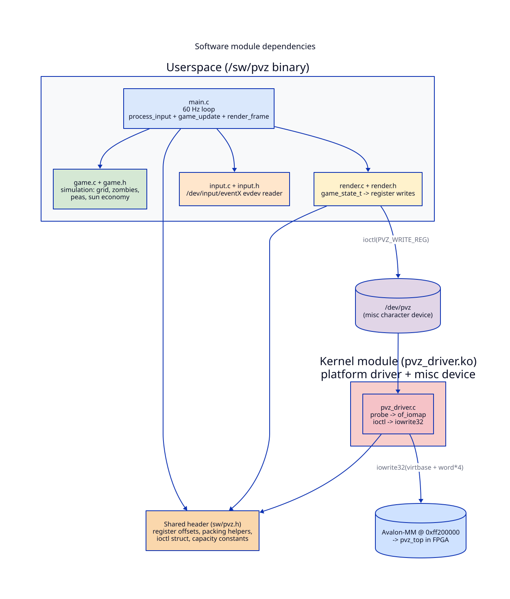

# 05 — Software deep dive

This chapter walks every file under `sw/`, with line citations.



The software is split across two binaries:

- **`pvz_driver.ko`** — a Linux kernel module that owns the FPGA's
  memory-mapped registers and exposes them as `/dev/pvz`.
- **`pvz`** — the userspace game executable. Opens `/dev/pvz`, polls
  input, runs the simulation at 60 Hz, and pushes scene updates to
  the kernel module via ioctl.

Both link against the shared header `sw/pvz.h`, which defines the
register map and the ioctl ABI.

## `sw/pvz.h` — the shared ABI

This is the **only** file included by both halves of the build. It is
the contract between the kernel driver and the userspace game.

What it declares:

- **Screen + grid constants** (`pvz.h:29-35`) — `PVZ_GRID_ROWS = 4`,
  `PVZ_GRID_COLS = 8`, `PVZ_CELL_SIZE = 64`, `PVZ_GRID_X = 64`,
  `PVZ_GRID_Y = 112`, `PVZ_SCREEN_W = 640`, `PVZ_SCREEN_H = 480`.
  These mirror the localparams in `hw/bg_grid.sv:28-31` and
  `hw/entity_drawer.sv:92-94`. If you change one, you must change
  all three by hand.
- **Hardware capacity** (`pvz.h:38-39`) — `PVZ_MAX_ZOMBIES = 8`,
  `PVZ_MAX_PEAS = 8`. Exceeding these from the game side silently
  drops extra entities (see `render.c:72-78`).
- **Register indices** (`pvz.h:42-49`) — symbolic names like
  `PVZ_REG_PLANTS`, `PVZ_REG_ZOMBIE(i)`, `PVZ_REG_SUN`. Use these
  rather than literal integers; chapter 06 has the full table.
- **Packing helpers** (`pvz.h:52-65`) — two `static inline`
  functions that produce the 32-bit word an entity register expects:

  ```c
  pvz_pack_entity(alive, row, x_pixel)
      = (alive << 31) | (row << 10) | x_pixel
  pvz_pack_cursor(visible, row, col)
      = (visible << 31) | (col << 2) | row
  ```

  The masks (`& 1`, `& 3`, `& 7`, `& 0x3FF`) are defensive — they
  prevent caller-side bugs from corrupting adjacent bit fields.

- **Ioctl struct + magic** (`pvz.h:68-74`):

  ```c
  typedef struct {
      unsigned int word_index;  /* 0..50 */
      unsigned int value;       /* 32-bit value to write */
  } pvz_write_arg_t;

  #define PVZ_WRITE_REG  _IOW('p', 1, pvz_write_arg_t)
  ```

  Exactly one ioctl exists; there is no read path.

## `sw/pvz_driver.h` — driver-private state

Just two definitions (`pvz_driver.h:7-12`): `DRIVER_NAME = "pvz"` and
`struct pvz_dev` holding the I/O resource and the kernel-virtual
address that `of_iomap` returns. Only `pvz_driver.c` includes this.

## `sw/pvz_driver.c` — the kernel module

145 lines. Plain `platform_driver` + `miscdevice` pattern from the
Linux driver model.

### Probe (`pvz_driver.c:61-99`)

When the kernel parses the devicetree at boot and finds a node whose
`compatible` string matches `csee4840,pvz_gpu-1.0` (set by
`pvz_driver.c:112`), it calls `pvz_probe`. The sequence is:

1. `misc_register(&pvz_misc_device)` — creates `/dev/pvz`
   (`pvz_driver.c:65`).
2. `of_address_to_resource()` — pulls the physical address and size
   out of the devicetree node into `dev.res` (`pvz_driver.c:71`).
3. `request_mem_region()` — claims that physical range so no other
   driver can map it (`pvz_driver.c:77`).
4. `of_iomap()` — sets up a kernel-virtual mapping for that range,
   stored in `dev.virtbase` (`pvz_driver.c:83`).
5. `pr_info` the base address so you can confirm via `dmesg`
   (`pvz_driver.c:89`).

If anything fails the function unwinds in reverse order
(`out_release_mem_region` and `out_deregister` labels).

### Ioctl handler (`pvz_driver.c:30-48`)

The whole interface:

```c
static long pvz_ioctl(struct file *f, unsigned int cmd, unsigned long arg)
{
    pvz_write_arg_t w;
    switch (cmd) {
    case PVZ_WRITE_REG:
        if (copy_from_user(&w, (pvz_write_arg_t *)arg, sizeof(w)))
            return -EACCES;
        if (w.word_index >= PVZ_NUM_REGS)
            return -EINVAL;
        iowrite32(w.value, dev.virtbase + (w.word_index * 4));
        break;
    default:
        return -EINVAL;
    }
    return 0;
}
```

Three things to notice:

1. **`w.word_index * 4`** (`pvz_driver.c:40`). The Avalon slave is
   configured `addressUnits = WORDS` in
   `hw/pvz_top_hw.tcl:52`, but the CPU side is byte-addressed.
   `iowrite32` takes a byte offset. So the driver converts
   word → byte by multiplying by 4. This is exactly the gotcha
   `pvz_top.sv:22-24` and `pvz_driver.c:5-7` warn about.
2. **Bounds check** (`pvz_driver.c:38`). A bad `word_index` returns
   `-EINVAL` rather than scribbling on unrelated memory.
3. **`copy_from_user`** (`pvz_driver.c:36`). Standard kernel
   discipline: never trust a userspace pointer.

### Devicetree binding (`pvz_driver.c:110-115`)

```c
static const struct of_device_id pvz_of_match[] = {
    { .compatible = "csee4840,pvz_gpu-1.0" },
    {},
};
MODULE_DEVICE_TABLE(of, pvz_of_match);
```

Must match `hw/pvz_top_hw.tcl:23` exactly. The `MODULE_DEVICE_TABLE`
macro embeds this list in the module image so `udev` / `modprobe`
can autoload the module when the devicetree node appears — though in
practice we `insmod pvz_driver.ko` by hand.

### Init / exit (`pvz_driver.c:127-140`)

`platform_driver_probe` registers the driver and calls `pvz_probe`
immediately if a matching devicetree node already exists (which is
our case — the dtb is loaded at boot). The exit path unregisters
the driver.

## `sw/game.h` — game state definitions

102 lines of structs, enums, and tunable constants. The constants
are deliberately grouped:

- **Plants** (`game.h:18-22`) — `PLANT_COST = 50`,
  `SUNFLOWER_COST = 50`, `PLANT_FIRE_COOLDOWN = 120` frames (≈ 2 s),
  `PLANT_HP = 3`.
- **Zombies** (`game.h:24-32`) — `ZOMBIE_HP = 3`,
  `ZOMBIE_SPEED_FRAMES = 3` (one pixel every 3 frames ≈ 20 px/s),
  `ZOMBIE_WIDTH = 32` (used by *collision detection only* —
  the visual is 64 px wide via `hw/entity_drawer.sv:97-98`),
  `ZOMBIE_HEIGHT = 64`, `TOTAL_ZOMBIES = 5`,
  `ZOMBIE_SPAWN_MIN/MAX = 8 s / 15 s`, `ZOMBIE_EAT_COOLDOWN = 60`
  frames.
- **Projectiles** (`game.h:35-38`) — `MAX_PROJECTILES = 16`,
  `PEA_SPEED = 2` px/frame, `PEA_DAMAGE = 1`, `PEA_SIZE = 8`.
- **Sun economy** (`game.h:41-43`) — `INITIAL_SUN = 100`,
  `SUN_INCREMENT = 25`, `SUN_INTERVAL = 8 s`.

Note the mismatch between `ZOMBIE_WIDTH = 32` here and `ZOMBIE_W = 64`
in `hw/entity_drawer.sv:97`. The software treats zombies as half as
wide for collision purposes — peas need to overlap the visual
sprite's left half before they're considered hits
(`game.c:208-213`). This makes peas register sooner against
oncoming zombies, which feels less fiddly to play, at the cost of a
visual disconnect.

The three game structs (`game.h:55-95`):

```c
typedef struct {
    int type;           /* PLANT_NONE, PLANT_PEASHOOTER, PLANT_SUNFLOWER */
    int fire_cooldown;
    int hp;
} plant_t;

typedef struct {
    int active;
    int row;
    int x_pixel;
    int hp;
    int move_counter;   /* counts frames until next pixel move */
    int eating;
    int eat_timer;
} zombie_t;

typedef struct {
    int active;
    int row;
    int x_pixel;
} projectile_t;

typedef struct {
    plant_t      grid[4][8];
    zombie_t     zombies[8];
    projectile_t projectiles[16];
    int cursor_row, cursor_col;
    int selected_plant_type;
    int sun, sun_timer;
    int zombies_spawned, spawn_timer;
    int state;           /* STATE_PLAYING / WIN / LOSE; -1 means quit */
    int frame_count;
} game_state_t;
```

`MAX_PROJECTILES = 16` but the hardware only has `PVZ_MAX_PEAS = 8`
slots. The renderer truncates — chapter explains how. The four
public functions (`game.h:97-100`) are `game_init`, `game_update`,
`game_place_plant`, `game_remove_plant`.

## `sw/game.c` — the simulation

302 lines, no clock and no I/O — pure state transformation. The
public entry point is `game_update`, which advances the world by one
frame.

### `game_init` (`game.c:19-32`)

`memset` to zeros, then set the fields that need non-zero initial
values: `sun = 100`, `sun_timer = SUN_INTERVAL`, cursor at (0, 0),
selected plant = peashooter, `spawn_timer` randomized between
`ZOMBIE_SPAWN_MIN` and `MAX`.

### Place / remove (`game.c:34-64`)

Both operate on the current cursor cell:

- **Place** checks the cell is empty and the player can afford the
  cost (50 sun for either plant type), then installs the plant with
  full HP and a full fire cooldown.
- **Remove** unconditionally clears the cell if occupied. Refund is
  not implemented (this is intentional; PvZ doesn't refund either).

### `game_update` — the per-frame pipeline (`game.c:288-302`)

```c
void game_update(game_state_t *gs) {
    if (gs->state != STATE_PLAYING) return;
    gs->frame_count++;
    update_sun(gs);
    update_spawning(gs);
    update_firing(gs);
    update_projectiles(gs);
    update_zombies(gs);
    check_collisions(gs);
    check_win(gs);
}
```

Order matters: spawning runs before zombie movement so a newly spawned
zombie can take its first step in the same frame; collisions run after
both pea and zombie movement so the bounding boxes are in their
post-movement positions when we test them.

### `update_sun` (`game.c:264-272`)

Decrement `sun_timer` each frame; when it expires, add
`SUN_INCREMENT * (1 + count_sunflowers(gs))` and reset. So one
sunflower doubles passive income, two triple it, and so on. Counted
each tick rather than incrementally tracked — simpler, plenty fast at
60 Hz.

### `update_spawning` (`game.c:228-251`)

If we've spawned all `TOTAL_ZOMBIES = 5` zombies, stop. Otherwise
decrement `spawn_timer`; when it hits zero, find a free zombie slot
and activate it at `(SCREEN_W - 1, random row, hp = 3)`. Then re-roll
`spawn_timer` between 8 s and 15 s in frames.

### `update_firing` (`game.c:175-192`)

Walk all grid cells; for each peashooter, decrement
`fire_cooldown`. When the cooldown reaches zero **and** there is a
zombie in the same row (`zombie_in_row` helper at line 67), spawn a
pea and reset the cooldown to 120 frames. Sunflowers don't fire.

`spawn_pea` (`game.c:87-100`) finds the first free slot in the 16-slot
projectile array, sets its row, and places its x at the right edge of
the firing plant's cell (`GAME_AREA_X + (col + 1) * CELL_SIZE`). If
no slot is free the pea is silently dropped — comment on line 99
acknowledges this.

### `update_projectiles` (`game.c:159-172`)

Move each active pea right by `PEA_SPEED = 2` pixels; deactivate
when off-screen.

### `update_zombies` (`game.c:103-156`)

The most state-heavy function. Each zombie is in one of two states:
**moving** or **eating**.

If currently `eating`: re-check that the plant in front of the
zombie still exists (some other zombie may have eaten it). If not,
clear the eating state and fall through to movement. If yes,
decrement `eat_timer`; when it expires, damage the plant by 1 HP.
If the plant dies, clear the eating state. Either way, don't move
this frame.

If currently moving: increment `move_counter`; once it reaches
`ZOMBIE_SPEED_FRAMES = 3`, step left by one pixel. If the zombie's
`x_pixel` is now at the lawn's left edge or beyond, set
`state = STATE_LOSE` and bail. Otherwise check the cell column the
zombie is now over — if it contains a plant, transition into the
eating state with a fresh `eat_timer`.

### `check_collisions` (`game.c:195-225`)

Nested loop over projectiles × zombies. For each active pea/zombie
pair in the same row, test AABB overlap: `pea_right >= zombie_left
&& pea_left <= zombie_right`. On hit: damage zombie by 1, deactivate
pea, deactivate zombie if HP reaches 0. `break` after first hit so
one pea can't multi-hit through a stack of zombies.

### `check_win` (`game.c:275-286`)

Win condition: we have spawned all 5 zombies and none are still
active. (The earlier branch in `update_zombies` handles loss.)

## `sw/input.h` + `sw/input.c` — evdev input

`input.h` defines abstract action codes (`INPUT_UP`, `INPUT_SPACE`,
etc., `input.h:5-13`) and three functions: `input_init(path)`,
`input_poll()`, `input_close()`.

`input.c:21-29` opens the given `/dev/input/eventX` device with
`O_NONBLOCK`. Default device is `/dev/input/event0`
(`main.c:72`); pass a different path on the command line for a
different keyboard or gamepad.

`input.c:31-71` reads `struct input_event` records (24 bytes each,
defined by `<linux/input.h>`) in a tight loop until `read` returns
EAGAIN. For each event:

1. **`EV_ABS` hat axis events** (`input.c:42-51`). Some Xbox 360
   variants report the D-pad as an absolute hat axis rather than as
   discrete buttons. Negative `value` = left/up, positive =
   right/down. Zero is the release event; ignored to avoid spam.
2. **`EV_KEY` press events** (`input.c:54-67`). Only `value == 1`
   (key down) is acted on. The switch maps both keyboard `KEY_*`
   codes and `BTN_*` gamepad codes to the same `INPUT_*` action
   code. The pairings come from the xpad kernel driver's mapping
   for an Xbox 360 controller:

   | action | keyboard | xpad button |
   |--------|----------|-------------|
   | INPUT_UP    | Up arrow    | DPAD_UP |
   | INPUT_DOWN  | Down arrow  | DPAD_DOWN |
   | INPUT_LEFT  | Left arrow  | DPAD_LEFT |
   | INPUT_RIGHT | Right arrow | DPAD_RIGHT |
   | INPUT_SPACE | Space       | A (BTN_SOUTH) |
   | INPUT_D     | D           | B (BTN_EAST) |
   | INPUT_ESC   | Esc         | Start (BTN_START) |
   | INPUT_TAB   | Tab         | LB or RB (BTN_TL / BTN_TR) |

The function returns the *first* action it sees and bails — one
input per call. The main loop calls it in a `while` (`main.c:38`),
so all queued events get drained.

## `sw/render.h` + `sw/render.c` — `game_state_t` → register writes

124 lines that mostly serve as a dispatcher: walk `game_state_t`,
build register values, fire `PVZ_WRITE_REG` ioctls.

`render_init(int fd)` (`render.c:26-30`) stashes the FPGA fd in a
file-scope static. `write_reg(word_index, value)` (`render.c:20-24`)
is a thin wrapper that builds `pvz_write_arg_t` and calls `ioctl`.

`render_frame` (`render.c:108-124`) is the entry point. When
`state == STATE_PLAYING`, call every per-subsystem helper. When
state is WIN or LOSE, hide all entities (the main loop prints a
banner instead).

### `render_plants` (`render.c:32-47`)

Build two 32-bit bitmaps in one pass over the 32 grid cells. Each
peashooter sets bit `(row * 8 + col)` in `pea_bits`; each sunflower
sets the same bit in `sun_bits`. Two ioctl writes — to
`PVZ_REG_PLANTS` and `PVZ_REG_SUNFLOWER` — install both bitmaps in
hardware. This is the densest part of the protocol: 64 booleans
packed into 64 bits.

### `render_zombies` (`render.c:55-66`)

For each of `PVZ_MAX_ZOMBIES = 8` hardware slots, look up the
corresponding game-state zombie. If active, build
`pvz_pack_entity(1, row, x_pixel)`; if not, write 0 (`alive` bit
clear hides the sprite). Hardware slot `i` always mirrors game slot
`i` — there is no compaction.

### `render_peas` (`render.c:68-81`)

Different policy: walk the 16-slot game projectile array and copy
*active* peas into hardware slots 0..7 in order. Any leftover
hardware slots get written to 0. Excess peas (more than 8 active)
are silently dropped. This is the cost of the simulation having a
larger pool than the hardware can render.

### `render_cursor` (`render.c:83-88`)

One ioctl, encoding visible bit + col + row. Visible is forced off
when the game is not in `STATE_PLAYING` so the cursor doesn't sit
on top of the win/lose screen.

### `render_sun` and `render_selected` (`render.c:49-53, 90-95`)

Single writes to `PVZ_REG_SELECTED` and `PVZ_REG_SUN`. `render_sun`
masks to 14 bits to be safe; the hardware register only has 14 bits
of width anyway (`hw/pvz_top.sv:90`).

### `hide_all_entities` (`render.c:97-106`)

Used on WIN/LOSE: zero out every entity register so the screen
clears to plain lawn + HUD.

## `sw/main.c` — the 60 Hz loop

156 lines. Structure:

1. **Arg parsing** (`main.c:72-77`). Optional command-line argument
   selects which input device to read. Default `/dev/input/event0`.
2. **Setup** (`main.c:78-101`).
   - `srand((unsigned)time(NULL))` to seed zombie spawn rolls.
   - `open("/dev/pvz", O_RDWR)` to get a handle to the kernel
     driver. If this fails the user probably forgot to
     `insmod pvz_driver.ko` — the error message at line 85 says so.
   - `input_init`, `render_init`, `game_init`.
3. **Print banner** (`main.c:103-105`).
4. **Main loop** (`main.c:107-150`). One iteration per frame:

   ```c
   while (gs.state >= 0) {
       frame_start = get_time_usec();

       process_input(&gs);              // (1) input
       if (gs.state < 0) break;         //     ESC sets state = -1

       game_update(&gs);                // (2) simulation
       render_frame(&gs);               // (3) push to FPGA

       if (frame_count % 60 == 0)
           printf("\rSun: %3d ...", ...);   // (4) status line

       if (gs.state == STATE_WIN) { ...; break; }
       if (gs.state == STATE_LOSE) { ...; break; }

       long long elapsed = get_time_usec() - frame_start;
       if (elapsed < FRAME_USEC)
           usleep(FRAME_USEC - elapsed);    // (5) pace at 60 Hz
   }
   ```

   `FRAME_USEC = 16667` (`main.c:22`) ≈ 1/60 s. `get_time_usec`
   (`main.c:27-32`) is a `gettimeofday` wrapper.

5. **Cleanup** (`main.c:152-155`). `input_close`, `close(pvz_fd)`,
   return 0.

`process_input` (`main.c:34-68`) is the cursor + selection state
machine: arrows move the cursor (clamped to grid edges), Space
places a plant, D removes one, Tab toggles the selected plant type,
Esc sets `state = -1` which breaks the loop.

## `sw/Makefile` — build

Dual-mode (`Makefile:1, 6`). When invoked by the kernel build system
(`KERNELRELEASE` is set), it just declares `obj-m := pvz_driver.o`.
Otherwise, it has two top-level targets:

- `make module` — re-invokes the kernel build system with
  `${MAKE} -C ${KERNEL_SOURCE} SUBDIRS=${PWD} modules`. Produces
  `pvz_driver.ko`. `KERNEL_SOURCE` defaults to
  `/usr/src/linux-headers-$(uname -r)`.
- `make pvz` — compiles `main.c game.c render.c input.c` into the
  `pvz` binary with `-Wall -O2 -lpthread`. (The `-lpthread` is
  vestigial; no thread is created on this branch.)

`make default` (also `make`) does both. `make clean` removes module
artifacts and the `pvz` binary.

There is no separate cross-compile target — to cross-compile, you
override `CC`, `ARCH`, `CROSS_COMPILE`, and `KERNEL_SOURCE` on the
command line. Chapter 08 gives the exact invocation.
