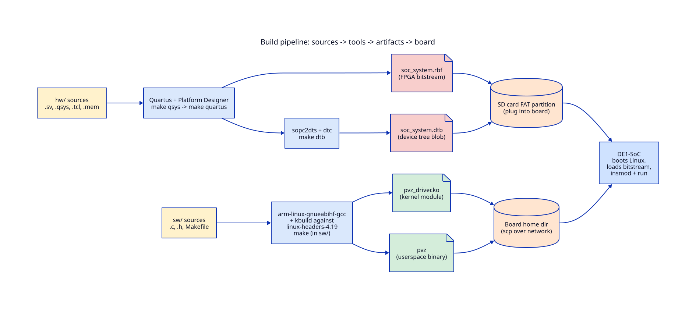

# 08 — Build and run

This chapter is the practical "how do I make my change show up on the
board" guide. Hardware and software follow different flows; both
ultimately produce files you copy to the board's SD card.



## Workstation prerequisites (Quartus + cross-compile)

Anything in `hw/` requires Quartus Prime + Platform Designer +
ARM cross-compile tools. These are pre-installed on the Columbia
EE workstations `micro1.ee.columbia.edu` … `micro10.ee.columbia.edu`,
which are the supported environment. The hardware Makefile assumes
you have sourced `embedded_command_shell.sh` first, which puts
`quartus_sh`, `qsys-generate`, `sopc2dts`, and `dtc` on your PATH.

Software-only changes (anything in `sw/`) can be built natively on
the board itself once Linux is up — see "Native build on the board"
below.

## Hardware build flow

All commands run from `hw/`. Steps must run in order the first time;
on subsequent rebuilds you can usually start at the step matching
your change.

```bash
cd hw/

# Step 1: generate Quartus project files from soc_system.tcl
make project
#   produces soc_system.qpf, .qsf, .sdc

# Step 2: generate Verilog from the Platform Designer system file.
# Run this after editing soc_system.qsys or pvz_top_hw.tcl.
make qsys
#   produces soc_system/synthesis/  and soc_system.sopcinfo

# Step 3: full synthesis, place, route. Takes 30–60 minutes.
make quartus
#   produces output_files/soc_system.sof

# Step 4: convert the bitstream into a raw binary for SD card boot.
make rbf
#   produces output_files/soc_system.rbf

# Step 5: generate the device tree blob (needs embedded_command_shell.sh).
make dtb
#   produces soc_system.dtb
```

Two artifacts come out of the hardware flow:
`output_files/soc_system.rbf` (the bitstream) and `soc_system.dtb`
(the devicetree).

Common pitfalls:

- **Forgot `embedded_command_shell.sh`**: `make dtb` fails with a
  message at `hw/Makefile:73`. Source the script and retry.
- **Did not run `make qsys` after editing `pvz_top_hw.tcl`**: Quartus
  uses stale Verilog and your hardware change isn't compiled in.
- **`make quartus` succeeds but the design behaves wrong**: check
  `hw/quartus_build.log` for timing warnings. The design currently
  closes timing at 50 MHz; if a stage 1 combinational path through
  `entity_drawer.sv` grows, you may see "negative slack" errors.

## Software build flow

### Native build on the board (simplest)

After deploying the kernel module and devicetree once (see below),
you can edit `.c` files directly on the board and rebuild in place:

```bash
cd /home/root/pvz/sw   # or wherever you put it
make                   # builds both pvz_driver.ko and pvz
```

`make` invokes:

- `make module` — kbuild against `/usr/src/linux-headers-$(uname -r)`,
  producing `pvz_driver.ko`.
- `make pvz` — `gcc -Wall -O2 -o pvz main.c game.c render.c
  input.c -lpthread`.

### Cross-compile from a workstation

If you want to build on a workstation and `scp` the binaries to the
board, override the toolchain variables. The exact kernel-headers
path depends on your environment; the project's CI infrastructure
historically uses headers version 4.19.0.

```bash
cd sw/
make CC=arm-linux-gnueabihf-gcc \
     ARCH=arm \
     CROSS_COMPILE=arm-linux-gnueabihf- \
     KERNEL_SOURCE=/path/to/linux-headers-4.19.0-arm
```

Outputs:

- `sw/pvz_driver.ko` — the kernel module.
- `sw/pvz` — the userspace game executable.

## Getting artifacts onto the board

The board boots from the SD card. The boot partition (FAT) holds the
FPGA bitstream and devicetree blob, plus U-Boot, kernel, and
rootfs. The rootfs partition (ext) holds Linux userspace.

### SD card path (bitstream + dtb)

These need to be on the SD's FAT partition, replacing the ones from
the previous build. With the SD card mounted on your workstation:

```bash
cp hw/output_files/soc_system.rbf /media/$USER/de1soc_boot/
cp hw/soc_system.dtb               /media/$USER/de1soc_boot/
```

Then unmount the SD, plug it back into the board, and power-cycle.
U-Boot loads the bitstream into the FPGA before booting Linux.

### Network path (kernel module + binary)

The `.ko` and the `pvz` binary live in the rootfs and can be copied
over the network without touching the SD card. With the board on
the same LAN as your workstation:

```bash
scp sw/pvz_driver.ko sw/pvz root@<board-ip>:/home/root/pvz/
```

Find the board's IP by running `ifconfig` on its serial console.

## Loading the driver and running the game

Connect to the board's serial console from your workstation:

```bash
screen /dev/ttyUSB0 115200
```

Log in as root (no password by default on the class image). Then,
on the board:

```bash
cd /home/root/pvz

# Load the kernel module
insmod pvz_driver.ko

# Confirm it probed correctly
dmesg | tail
#   expected: pvz: init
#             pvz: initialized at 0xff200000
cat /proc/iomem | grep ff20
#   expected: ff200000-ff20XXXX : pvz

# Find your input device (gamepad / keyboard)
ls /dev/input/
#   typical: event0  event1  ...
# Test which one is active:
cat /dev/input/event0    # press a key/button; if bytes appear, that's it

# Run the game
./pvz /dev/input/event0
```

The game prints a banner on the serial console and the lawn appears
on the VGA monitor. Controls:

| input | keyboard | Xbox 360 gamepad |
|-------|----------|------------------|
| Move cursor | Arrow keys | D-pad (or hat axes) |
| Place plant | Space | A button |
| Remove plant | D | B button |
| Toggle peashooter / sunflower | Tab | LB or RB |
| Quit | Esc | Start |

The status line at the bottom of the serial console updates once a
second with current sun, zombies spawned, and frame count. WIN / LOSE
banners print on game-over, the screen clears for 5 seconds, then
the program exits.

## Reloading after a software change

If you only changed userspace C files, no module reload is needed:

```bash
make pvz && ./pvz /dev/input/event0
```

If you changed the kernel module (`pvz_driver.c` or `pvz_driver.h`)
or the shared header `pvz.h` (because it affects the ioctl ABI):

```bash
rmmod pvz_driver       # unload the running module
make                   # rebuild .ko and binary
insmod pvz_driver.ko   # load the new one
./pvz
```

`rmmod` will fail if `/dev/pvz` is still open by another process —
make sure no leftover `./pvz` is running.

## Reloading after a hardware change

You need a new bitstream and possibly a new devicetree. On the
workstation: `make qsys` + `make quartus` + `make rbf` + `make dtb`,
then copy both files to the SD card's FAT partition and power-cycle
the board. After Linux comes up, reload the kernel module
(`rmmod pvz_driver` + `insmod pvz_driver.ko`) so the driver's `probe`
runs against the freshly-built devicetree.

## Debugging cheat sheet

```bash
# Confirm the driver probed and mapped the right address
dmesg | grep pvz
cat /proc/iomem | grep pvz

# Confirm the devicetree node is present
ls /proc/device-tree/sopc@0/

# Increase kernel log verbosity (default hides pr_info)
echo 8 > /proc/sys/kernel/printk

# See exactly what bytes go to /dev/pvz (requires strace built for ARM)
strace -e ioctl ./pvz 2>&1 | head -100
```
