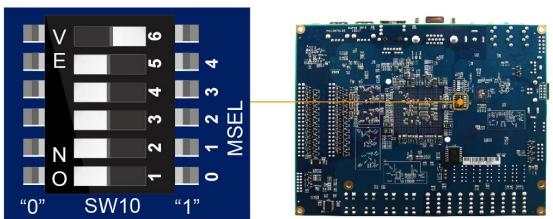
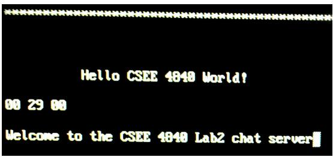

# csee 4840

# Embedded System Design

# Lab 2: Using C, Linux, Sockets, and usb

Stephen A. Edwards

Columbia University

Spring 2026

Code and compile C under Linux on the DE1-SoC board. Implement a primitive Internet chat client that communicates with a server. Receive keystrokes and draw on a framebuffer.

# 1 Introduction

Unlike the first lab, this lab only involves developing software. We supply a platform on an sd card that consists of Linux running on the arm processors on the fpga on the DE1-SoC board. A fpga configuration adds a video framebuffer.

You will implement an Internet-based chat client on this platform. When a user types a line of text on the attached usb keyboard, it will appear on the video display. When they press Enter, the contents of the line should be sent through the Ethernet port to a chat server, which will then broadcast it to all its connected clients. You can set up a chat server yourself and test it with telnet, nc, or debug it with your friends.

These instructions are written referring to the workstations in 1235 Mudd, which are named micro01.ee.columbia.edu through micro36.ee.columbia.edu. This lab can be done using your own laptop, but you may have to install terminal emulation software. You will also need a vga monitor, a usb keyboard, and a wired Internet connection. All of these are provided in 1235 Mudd, but there’s nothing special about them.

# 2 Booting the Board

Set the fpga configuration mode switches (sw10, on the underside of the board) to 100000.

This setting for the msel switches instructs the fpga to accept its configuration from the arm processors.



If this is set differently, the system may not boot, or may boot but not produce video.

We will provide you with pre-flashed micro sd cards with the lab 2 environment, but you may also flash your own. Download lab2-img.tar.gz from the class website, unpack it to create the (sparse) 16 gb lab2-16G.img file, and then flash it using dd (slow) or bmaptool (much faster).

Insert the micro sd card for lab 2 into the socket on the board (upper right).

Connect your workstation to the board using the mini usb cable that came with the kit. The connector is at the upper right corner of the board.

On your workstation, start the screen terminal emulator in a new window as follows:

screen /dev/ttyUSB0 115200

This establishes a 115200-baud serial connection to the hps system on the board through an ftdi usb serial chip. The usb serial port should appear when the cable is connected, even if the board is not yet powered on.

Control-a k will terminate screen, or just unplug the mini usb cable.

Power on the board. You should quickly see boot messages that include

U-Boot SPL 2013.01.01 (Jan 12 2019 - 19:40:48)

BOARD : Altera SOCFPGA Cyclone V Board

CLOCK: EOSC1 clock 25000 KHz

reading u-boot.img

U-Boot 2013.01.01 (Jan 12 2019 - 19:41:00)

CPU : Altera SOCFPGA Platform

Hit any key to stop autoboot: 5

Let the boot continue. It should configure the fpga (soc_system.rbf ), start the kernel (zImage), and load the the Device Tree (soc_system.dtb):

```txt
reading u-boot.scr   
226 bytes read in 4 ms (54.7 KiB/s)   
## Executing script at 02000000   
reading soc_system.rbf   
7007184 bytes read in 344 ms (19.4 MiB/s)   
## Starting application at 0x3FF79598 ...   
## Application terminated, rc = 0x0   
reading zImage   
4877224 bytes read in 240 ms (19.4 MiB/s)   
reading soc_system.dtb   
31245 bytes read in 7 ms (4.3 MiB/s)   
## Flattened Device Tree blob at 00000100 Loading Device Tree to 03ff5000, end 03fffa0c ... OK   
Starting kernel ...   
[ 0.000000] Booting Linux on physical CPU 0x0   
[ 0.000000] Linux version 4.19.0 (sedwards@zaphod) (gcc version 6.2.0 [ 0.000000] CPU: ARMv7 Processor [413fc090] revision 0 (ARMv7), 
```

If it stops after Starting kernel, check the switches on the back of the board.

The kernel should eventually mount the root directory on the sd card and start /sbin/init:

```txt
[1.835185]EXT4-fs (mmcblk0p2): mounted filesystem with ordered data [1.843283] VFS: Mounted root (ext4 filesystem) on device 179:2. 
```

```txt
[1.885157] Run /sbin/init as init process 
```

Soon, Ubuntu will start running and the messages will start looking like

```txt
Welcome to Ubuntu 16.04.5 LTS!  
[ OK ] Listening on Journal Socket (/dev/log). 
```

and will eventually present a login prompt:

```batch
Ubuntu 16.04.5 LTS de1-soc ttyS0  
de1-soc login: 
```

Login as root with password CSee4840! Change the password by running passwd.

Connect your board to the network using an Ethernet cable, then start the network:

```txt
root@de1-soc:~# ifup eth0 
```

The system will report some DHCPDISCOVER messages followed by DHCPOFFER and DHCPACK. You can force the system to always start eth0 on boot by adding “auto eth0” to /etc/network/interfaces, but only do this if you will always be connected to the network.

By default, Linux thinks your terminal is $8 0 { \times } 2 4$ ; this may be changed by stty, e.g.,

```txt
stty rows 43  
stty cols 132 
```

# 3 Installing Development Software

By design, the lab 2 sd card image includes very little; you need to add additional software to complete lab 2. You should only need to do this once.

Connect your board to the network, configure the network interface, update package information, and bring everything up-to-date.

```txt
ifup eth0 apt update apt upgrade -y 
```

For lab 2, install the C compiler, make, libusb, and usbutils:

```txt
apt install -y gcc make libusb-1.0-0-dev usbutils 
```

You will probably want to install a terminal-based text editor. Here are two options:

```batch
apt install -y nano  
apt install -y vim-tiny 
```

You may also install the larger vim or emacs-nox packages.

The scp program copies files to and from the DE1-SoC board (via Ethernet). Install it with

```batch
apt install -y openssh-client 
```

Use wget to download files from the class webpage:

```txt
apt install -y wget 
```

Finally, you can recover some space after these packages are installed with

```txt
apt clean 
```

# 4 Compiling and Running the Skeleton Lab 2 Files

First, connect a usb keyboard and vga monitor to your board. Both kinds of connectors are along the top of your board (vga uses a rounded trapezoid holding 19 pins).

Copy the lab2.tar.gz file to your board. Download it from the class website with wget:

```txt
wget http://www.cs.columbia.edu/~sedwards/classes/2026/4840-spring/lab2.tar.gz 
```

You can also use scp to copy files from your workstation (provided it is running an ssh server) or simply copy the file onto your sd card after you mount it on your workstation.

Next, unpack and edit the provided lab2 skeleton:

```txt
tar zxf lab2.tar.gz  
cd lab2  
vi lab2.c 
```

Put your name(s) in the comments at the beginning of lab2.c.

Set the SERVER_HOST value to the ip address of the chat server you are going to use. We will try to keep a server running on arthur.cs.columbia.edu whose address is 128.59.19.114; post a message on Ed if the server is not working. If you have the telnet program installed (e.g., apt install telnet), you may test the server by running

```txt
telnet arthur.cs.columbia.edu 42000 
```

Or, use nc

```txt
nc arthur.cs.columbia.edu 42000 
```

Next, compile and run the skeleton code:

```batch
root@de1-soc:~/lab2# make  
cc -Wall -c -o lab2.o lab2.c  
cc -Wall -c -o fbputchar.o fbputchar.c  
cc -Wall -c -o usbkeyboard.o usbkeyboard.c  
cc -Wall -o lab2 lab2.o fbputchar.o usbkeyboard.o -lusb-1.0 -pthread  
root@de1-soc:~/lab2# ./lab2  
Welcome to the CSEE 4840 Lab2 chat server 
```

On the vga monitor driven by the board, you should see a “hello world” message.

When a key is pressed on the usb keyboard, this skeleton client will display three hexadecimal numbers indicating the message received.



This skeleton client also displays messages received from the chat server.

The skeleton client will quit (return to a command prompt) if you press Esc on the keyboard.

If you get an error like

```txt
root@de1-soc:~/lab2# ./lab2  
Error: connect() failed. Is the server running? 
```

there may not be a chat server running, you may have the wrong SERVER_HOST value, your chat server may be behind a firewall, or something is wrong with the board’s connection to the network. Use telnet or nc to start diagnosing the problem.

# 5 The Framebuffer

A framebuffer is a region of memory that is displayed as pixels on a monitor. For this lab, we are supplying you with an fpga configuration and Linux kernel that provides a framebuffer device named /dev/fb0.

To use this device in a user-level program, open the device file and call mmap() to make it appear in the process’s address space. In fbputchar.c, the fbopen() function does this for you. Also in this file is the fbputchar() function, which displays a single character on the screen, and fbputs(), which displays a string. See lab2.c for a simple demonstration of their use.

Once mapped, the framebuffer memory appears as a sequence of pixels in the usual raster order: the upper left pixel appears first, followed by the one just to its right. The next row of pixels starts immediately after the first row ends.

Each pixel is a group of four bytes; the first three represent red, green, and blue intensities; the fourth is unused.

For this lab, you may want to add functions that clear the framebuffer, scroll a region of the framebuffer (try memcpy() here), draw lines, etc. You may also want to modify fbputchar() to use different colors, a different font, etc.

# 6

# Networking

We will use Internet protocols to communicate to and from a chat server. Each computer connected to the Internet has a numeric ip address; the micro01 workstation is “128.59.64.121”. Within each computer, servers communicate on ports, which are numbered starting from 1. For example, webservers listen on port 80 and ssh uses port 22. Our chat server uses port 42000.

“Sockets” is the standard api for network communcation in Linux. You send and receive data to and from programs on remote computers using read() and write() system calls.

The main function in lab2.c creates, opens, and listens to a socket. For example,

```c
// Create an Internet socket  
int sockfd = socket(AF_INET, SOCK_STREAM, 0);  
// Connect to the server  
#define IPADDR(a,b,c,d) (htonl((a) << 24) | ((b) << 16) | ((c) << 8) | (d)))  
#define SERVER_HOST IPADDR(192,168,1,1)  
#define SERVER_PORT htons(42000)  
struct sockaddr_in serv_addr = { AF_INET, SERVER_PORT, {SERVER_HOST } };  
connect(soapfd, (struct sockaddr *) &serv_addr, sizeof(serv_addr));  
// Write to the socket  
write(soapfd, "Hello World!\n", 13);  
// Read from the socket  
#define BUFFER_SIZE 128  
char recvBuf[BUFFER_SIZE];  
read(soapfd, &recvBuf, BUFFER_SIZE - 1)); 
```

Note that as shown, this code is unsafe because each of these functions can fail. Their return values must be checked for errors.

# 7 USB

We use the libusb C library for communicating with the usb keyboard. The usb protocol is rich and complicated, allowing it to work with peripherals as diverse as keyboards, hard drives, and speakers; libusb hides many of the details, especially those related to intializing and communicating with the usb controller chip.

Usb is a networking protocol like ip, but assumes a simple, tree-shaped network consisting of a single host connected to peripherals and hubs that fan out. While it is possible to directly address the tree structure of the network, libusb allows us to ignore it.

To communicate with a usb keyboard, we first have to find its address. Because there are so many kinds of usb devices, we will look at each connected device and determine if it is a keyboard before attempting to receive keystrokes from it.

The code in the openkeyboard() function in usbkeyboard.c does this: it initializes libusb, enumerates all the currently connected devices, then checks each one to see if it is part of the “Human Interface Device” (hid) class and speaks the keyboard protocol (hid devices also include mice). If openkeyboard() finds a keyboard, it attempts to connect to it.

In lab2.c, keypress events are received from the usb keyboard using the libusb function libusb_interrupt_transfer(). This returns an eight-byte packet consisting of a byte indicating which modifier keys (such as Shift) are pressed, an unused byte, and six bytes holding keycodes of pressed keys or 0.

Usb keyboards use their own, non-ascii keycodes. Consult section 10 (page 53) of the usb Implementer’s Forum documentation1 for details.

The skeleton code in lab2.c receives and displays the modifier and the first two keycode bytes. For example, when the “A” key is pressed, it displays “00 04 00,” and when it is released, “00 00 00.” Shift-A produces $^ { \mathrm { * } } 0 2 0 4 0 0 .$ ,” and Ctrl, A, and C together give $^ { \ast } 0 1 0 4 0 6 \mathrm { ; }$ ”

Reading from a socket and reading from the usb keyboard are blocking operations, meaning they do not return until new data is available. This is a problem because we must be able to receive messages from other users while we are typing.

A solution is to run two threads. These are effectively separate program counters within the same program; we can have one waiting for networking communication while the other waits for events from the keyboard.

In lab2.c, we spawn one thread to receive data from the network, leaving the main program thread to handle the usb keyboard. The basic template is this:

```c
include <pthread.h>   
pthread_t network_thread;   
void \*network_thread_f(void \*)   
{ // Code to be run in parallel with the main program   
}   
int main()   
{ // Start the network thread   
pthread_create(&network_thread, NULL, network_thread_f, NULL);   
// Do stuff in parallel with the network thread   
// Wait for the network thread to terminate   
pthread_join(network_thread, NULL);   
} 
```

Threads can communicate with each other and the main program through global variables. To avoid race conditions (i.e., where one thread is reading while the other writing), the pthread library provides mutexes (mutual exclusion constructs) that can be used to enforce exclusive access to global variables.

Start from the partially working skeleton in lab2.tar.gz and extend it as follows:

• Make the display work properly and look good. fbputchar.c has the framebuffer initialization code and some simple character generation code.

– Clear the screen when the program starts.   
– Split the screen into two parts with a horizontal line. Have the user enter text on the bottom two rows; use the rest to record what s/he and other users send.   
– When a packet arrives, print its contents in the “receive” region. Don’t forget to wrap long messages across multiple lines.   
– When printing reaches the bottom of the area, you may either start again at the top, or scroll the entry region of the screen.   
– Implement a reasonable text-editing system for the bottom of the screen. Have input from the keyboard display characters there and allow users to erase unwanted characters and send the message with return. Clear the bottom area when a message is sent.   
– Display a cursor where the user is typing. This could be a vertical line, an underline, or a white box.

• Make the keyboard input work. Specifically,

– Convert the usb keycodes into ascii to display and send them over the network.   
– Make both shift keys work (i.e., do upper and lowercase characters)   
– Make the left and right arrow keys work   
– Make the backspace key work

• Complete the network communication

– When your client receives a packet from the server, display it on the next line at the top of the screen.   
– When the user presses return, have your client send to the server the text s/he has been typing and display it in the text area at the top of the sceen.

# 10 What to turn in

Put every group member’s name and uni in the comments in the lab2.c file.

Run make lab2.tar.gz on the board in your lab2 directory to collect all the source code, and submit your group’s lab2.tar.gz via Courseworks.

Demonstrate your working lab2 to a ta during his office hours.

# 11 Demo Instructions

1. Type It is a period of civil war.   
2. Press ↱ Enter   
3. Type Rebel spaceships, striking from a hidden base, have won their first victory against the evil Galactic Empire.   
4. Press ↱ Enter   
5. Type During the battle, Rebel Spies managed to steal secret plans to the Empire’s ultimate weapon, an armored   
6. Press ← Backspace to erase the text after the second comma   
7. Type the DEATH STAR, an armored space station with enough power to destroy an entire planet. This will be more text than fits on the screen. Type as much as fits on the screen, then type a few more letters to show what happens.   
8. Type Pursued by the empire’s   
9. Press $\sqcap $ to move the cursor and capitalize the e in empire   
10. Press $\lceil  \rceil$ to return the cursor the the end of the text   
11. Type esteemed agents, Princess Leia races home aboard her starship,   
12. Press $\sqcap $ to to move the cursor and change esteemed to sinister   
13. Press ↱ Enter without returning the cursor to the end of the text   
14. Type Space, the final frontier.   
15. Press ← Backspace to erase all of the text   
16. Press ← Backspace again   
17. Type custodian of the stolen plans that can save her people and restore freedom to the galaxy.   
18. Press ↱ Enter   
19. Demonstrate the special keys by typing each of them   
20. Press ↱ Enter   
21. Press and hold the ‘r’ key as you Type Star Wars   
22. If your screen has not yet filled up, keep sending messages to the server until it does.